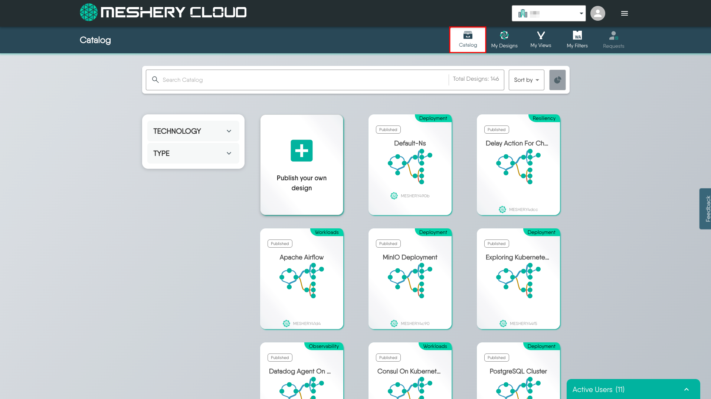
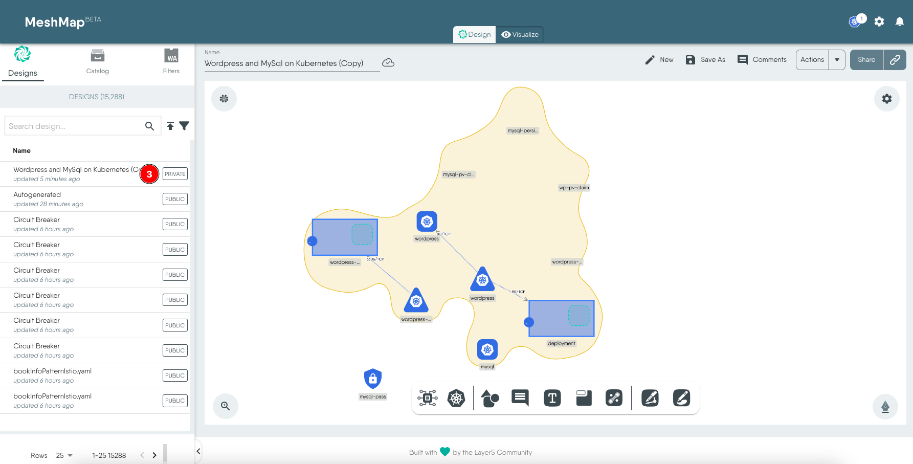

Starting from a pattern is a quick way to get started with a popular stack or solution.

## Exploring the Design Catalog

The design catalog can be accessed from two locations:
 - From the Catalog tab in MeshMap Design view.

   

 - From the Meshery Cloud catalog page at [Meshery Cloud Catalog](https://meshery.layer5.io/catalog).

   

## Copying a Design

To start from a pattern, select and create a copy of the design. If you are on the MeshMap design page, click on the chosen design from the **Catalog** tab. This will present a popup to clone the design, click **Clone** to begin.

This will create a copy of the catalog item to a new design, now owned by you.

You are now free to deploy it as it is or modify it further. 
