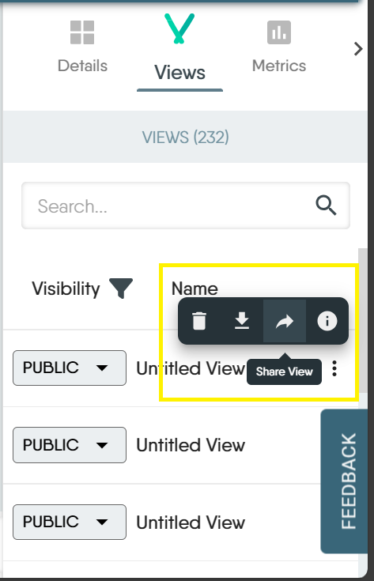
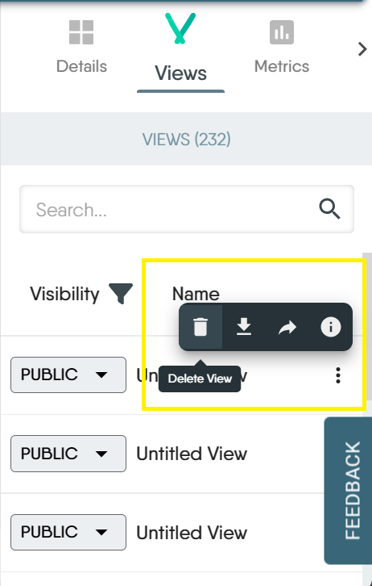

The Views tab is located on the right side of the screen just beside the Details tab in MeshMap Visualizer. It allows you to see all containers the present in your Kubernetes cluster. Think of views for Visualizer mode as you would design for the Designer mode. 

## Managing Views
Here's what you can do with views in Visualizer:

### 1. Save a view
  To save a view, simply give your view a title in the Name field at the top of the canvas. Any changes made to the view will be automatically saved. Alternatively, click on the "Save as" button at the top of the canvas. A modal will pop up for you to give your view a name and save it.

  
### 2. Set view visibility
  You can choose to set your views to be either public or private. When views are set as public, everyone within your workspace can access these views. Views set as private are visible only to the person who created the view, ie the owner. 

  
### 3. Share a view
  Sharing a view lets you collaborate with team members. In the share modal, you can add the user you want to share the view with. You can also set your view access as either public or private. When it's set to public, anyone with the link to the view can edit the view. When it's set to private, others can view but only the owner can edit.

### 4. Delete a view
  You can delete a view when you no longer have use of it. You can only delete a view that you created. Views created by others and made public cannot be deleted, except by the owner of that view.

  
### 5. Export a view
  To export a view,
  1. Click on the more icon to the right of the view you want to export.

     

  3. You'll find a list of actions. Export is the second icon from the left

     

  4. Click on the export icon. The view will be downloaded to your device in .json format
     
### 6. View info
  View info shows you the owner of the design, the view visibility (whether it's set to public or private), the date the design was created and the date it was last modified. If you're the owner of the view, you'll also see an input field where you can add notes about the design.

  
