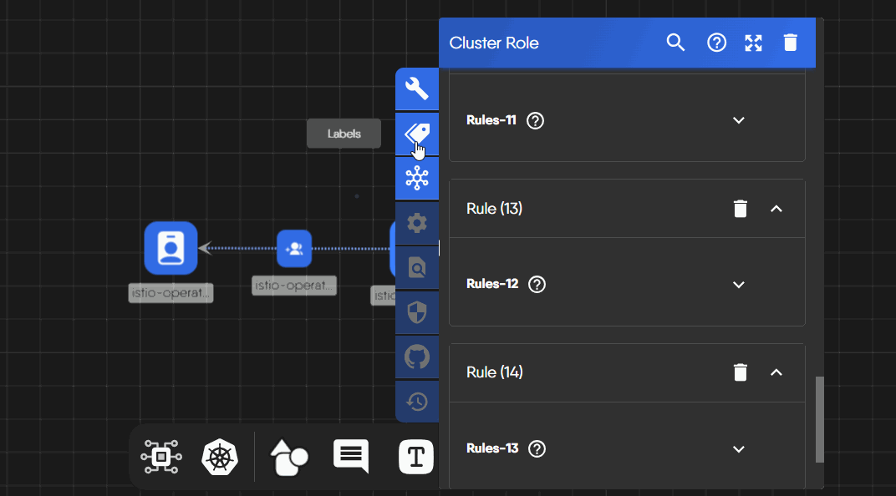
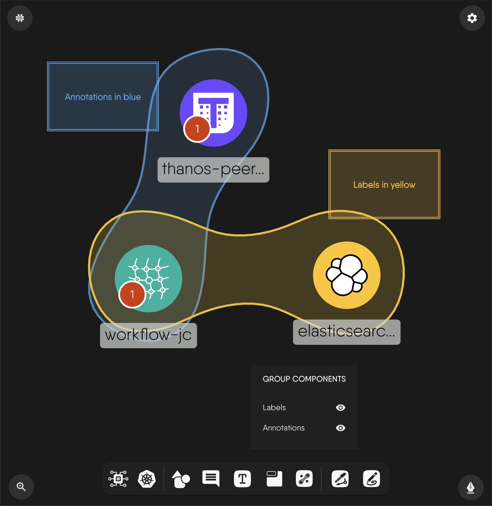

# Working with Tags

> Share design with other users and use control access to manage design access permissions and visibility.

You can group components using tags. Tags are key-value pairs that help you organize and categorize components within your design. Tags can be used to visually group components. You can also use tags to filter components and view only those that match the tag criteria.

  <h4 class="alert-heading">Related Concept</h4>
  
      Kubernetes resources are capable of being assigned Label and Annotation key/value pairs. When pairs of Labels or Annotations match, a relationship is formed and visualized as shown below.
  

## Grouping Components with Tags

To group components using tags, follow these steps.

## Labels and Annotations

Designs support two different types of tags: Labels and Annotations. Labels are often used to identify components and are visible on the design canvas. Annotations are often used to provide additional information about components.

  <h4 class="alert-heading" style="color: #EBC017;">Performance Consideration</h4>
  
      
Tags are indexed and searchable. However, the performance of design operations may degrade as the number of tags increases. To ensure an optimal user experience, we recommend using tags judiciously and limiting the number of tags used in a design.

Upon loading a design exceeds that exceeds 10 tags within a single design, Kanvas will automatically disable grouping by tags. You can manually enable grouping by tags by clicking the &ldquo;Group Components&rdquo; button in the Designer dock.

  

  <h4 class="alert-heading">Related Concept</h4>
  
      
  

