# Understanding Tool Modes

> Kanvas Designer offers three modes: Default, Pencil, and Connector, which behave differently based on the context in which they are used. Learn how to interact with components and the canvas in each mode.

<!-- set of custom keyboard button classes -->
<link rel="stylesheet" href="https://unpkg.com/keyboard-css@1.2.4/dist/css/main.min.css" />
Kanvas Designer offers three modes: Default, Pencil, and Connector, which behave differently based on the context in which they are used. Understanding these modes is essential for effectively interacting with components and the canvas.

You can switch between mouse modes using hotkeys or tool selection. Here are hotkeys that control your mode:

| Hotkeys                                                          | Description                                                                 |
|------------------------------------------------------------------|-----------------------------------------------------------------------------|
| <button class="kbc-button kbc-button-xs">Spacebar</button>       | Temporarily enables the alternative mouse mode (default mode vs pan mode)  |
| <button class="kbc-button kbc-button-xs">H</button>              | Switches to pan mode (hand icon)                                           |
| <button class="kbc-button kbc-button-xs">Escape / V</button>     | Switches to default mode irrespective of which mode you are currently using.|

## Interacting with Components

<ul class="nav nav-tabs" id="tabs-0" role="tablist">
  <li class="nav-item">
      <button class="nav-link active"
          id="tabs-00-00-tab" data-bs-toggle="tab" data-bs-target="#tabs-00-00" role="tab"
          data-td-tp-persist="select tool" aria-controls="tabs-00-00" aria-selected="true">
        Select Tool
      </button>
    </li><li class="nav-item">
      <button class="nav-link"
          id="tabs-00-01-tab" data-bs-toggle="tab" data-bs-target="#tabs-00-01" role="tab"
          data-td-tp-persist="pencil tool" aria-controls="tabs-00-01" aria-selected="false">
        Pencil Tool
      </button>
    </li><li class="nav-item">
      <button class="nav-link"
          id="tabs-00-02-tab" data-bs-toggle="tab" data-bs-target="#tabs-00-02" role="tab"
          data-td-tp-persist="pen tool" aria-controls="tabs-00-02" aria-selected="false">
        Pen Tool
      </button>
    </li><li class="nav-item">
      <button class="nav-link"
          id="tabs-00-03-tab" data-bs-toggle="tab" data-bs-target="#tabs-00-03" role="tab"
          data-td-tp-persist="pan tool" aria-controls="tabs-00-03" aria-selected="false">
        Pan Tool
      </button>
    </li>
</ul>

    

        <table>
  <thead>
      <tr>
          <th>Action</th>
          <th>Cursor Style</th>
          <th>Behavior</th>
          <th>Example</th>
      </tr>
  </thead>
  <tbody>
      <tr>
          <td><strong>Hover</strong></td>
          <td><code>default (arrow)</code></td>
          <td>Nothing</td>
          <td>

  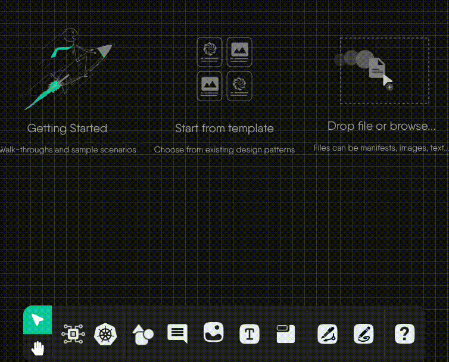

</td>
      </tr>
      <tr>
          <td><strong>Click-and-drag</strong></td>
          <td><code>move</code></td>
          <td>Moves component in the direction of the mouse</td>
          <td>

  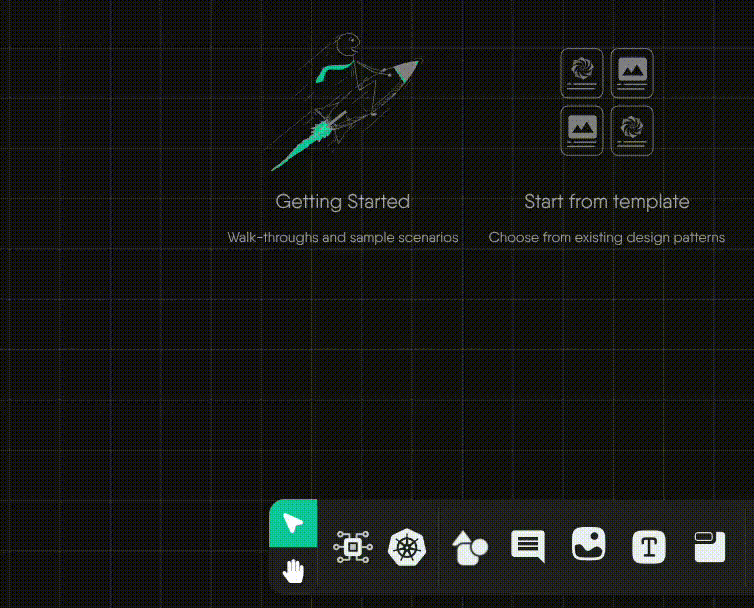

</td>
      </tr>
      <tr>
          <td><strong>Click</strong></td>
          <td><code>default (arrow)</code></td>
          <td>Displays component toolbar, resize box, and connection handles</td>
          <td>

  <picture>
    <source srcset="/contentimg/kanvas/designer/understanding-tool-modes/images/click_hu_e81bf5123ff045fd.webp" type="image/webp" width="1126" height="462">
    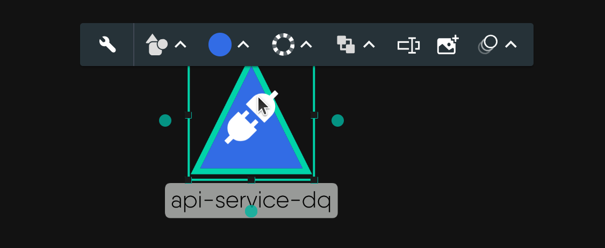
  </picture>

</td>
      </tr>
      <tr>
          <td><strong>Double-click (component)</strong></td>
          <td><code>pointer</code></td>
          <td>Opens the component configurator</td>
          <td>

  <picture>
    <source srcset="/contentimg/kanvas/designer/understanding-tool-modes/images/double_click_hu_83b454c3a6721403.webp" type="image/webp" width="1286" height="1120">
    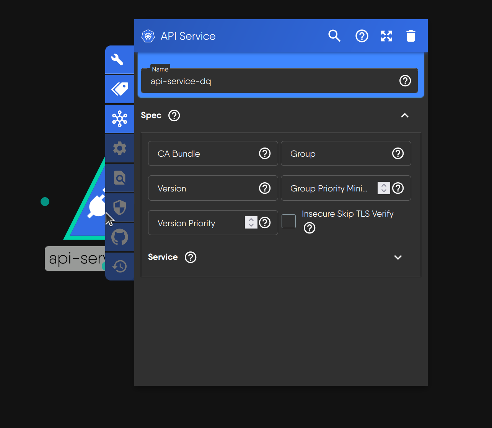
  </picture>

</td>
      </tr>
      <tr>
          <td><strong>Double-click (textbox)</strong></td>
          <td><code>text</code></td>
          <td>Enables text editing inside the component</td>
          <td>

  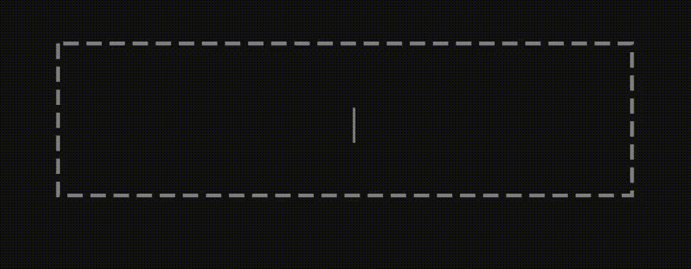

</td>
      </tr>
      <tr>
          <td><strong>Right-click</strong></td>
          <td><code>default (arrow)</code></td>
          <td>Opens the circular component context menu</td>
          <td>

  <picture>
    <source srcset="/contentimg/kanvas/designer/understanding-tool-modes/images/right_click_hu_bc3b42b8509b13b4.webp" type="image/webp" width="743" height="702">
    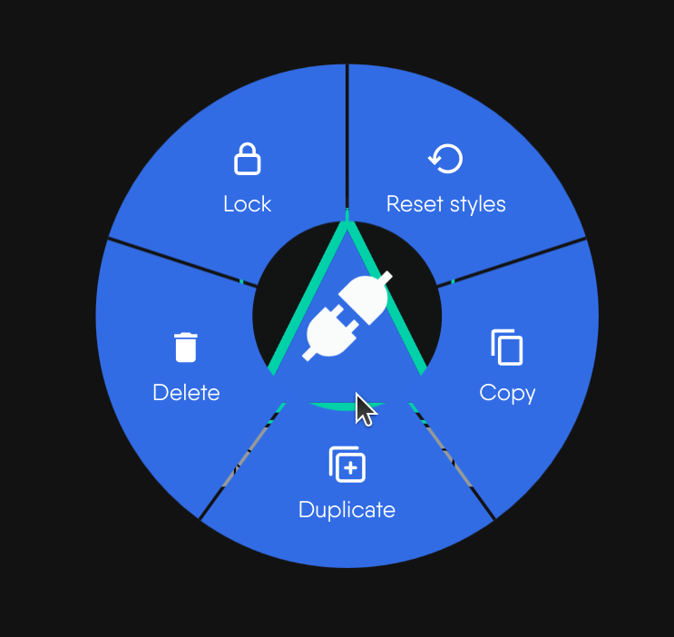
  </picture>

</td>
      </tr>
      <tr>
          <td><strong>Click-and-hold</strong></td>
          <td><code>crosshair</code></td>
          <td>Initiates box selection for selecting multiple components</td>
          <td>

  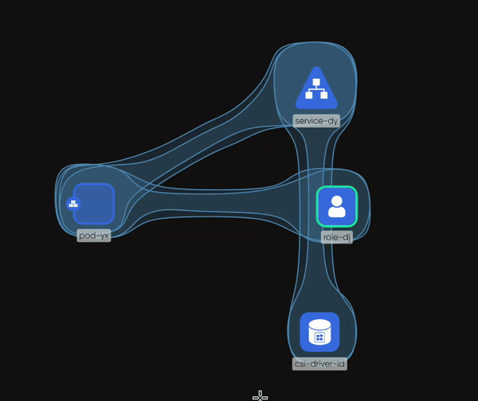

</td>
      </tr>
      <tr>
          <td><strong>Scroll wheel</strong></td>
          <td><code>default (arrow)</code></td>
          <td>Pan up or down</td>
          <td>

  

</td>
      </tr>
      <tr>
          <td><strong>Scroll wheel + CMD/CTRL</strong></td>
          <td><code>default (arrow)</code></td>
          <td>Zoom in/out</td>
          <td>

  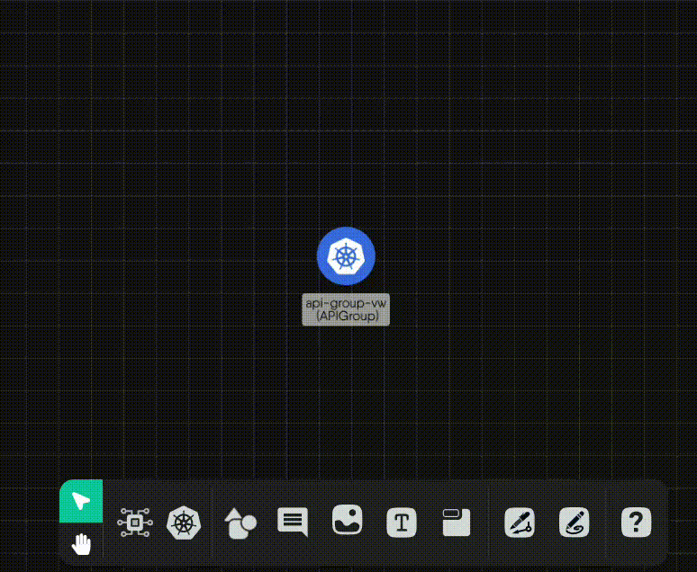

</td>
      </tr>
      <tr>
          <td><strong>Horizontal scroll wheel</strong></td>
          <td><code>default (arrow)</code></td>
          <td>Pan left or right</td>
          <td>

  

</td>
      </tr>
  </tbody>
</table>

    

    

        
Pencil lines do not connect individual components, but offer annotating capability, allowing you to take notes and draw annotations to enhance your designs.

<table>
  <thead>
      <tr>
          <th>Action</th>
          <th>Cursor Style</th>
          <th>Behavior</th>
          <th>Example</th>
      </tr>
  </thead>
  <tbody>
      <tr>
          <td><strong>Hover</strong></td>
          <td><code>custom(pencil)</code></td>
          <td>Nothing</td>
          <td>

  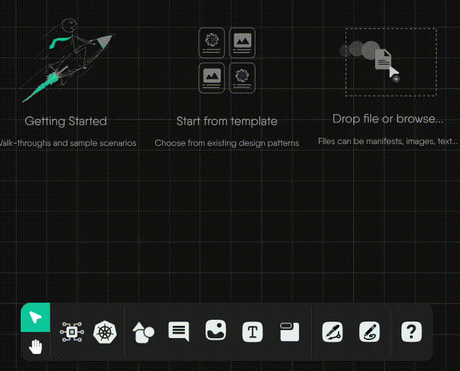

</td>
      </tr>
      <tr>
          <td><strong>Mouse down + drag</strong></td>
          <td><code>custom(pencil)</code></td>
          <td>Start drawing a freeform line</td>
          <td>

  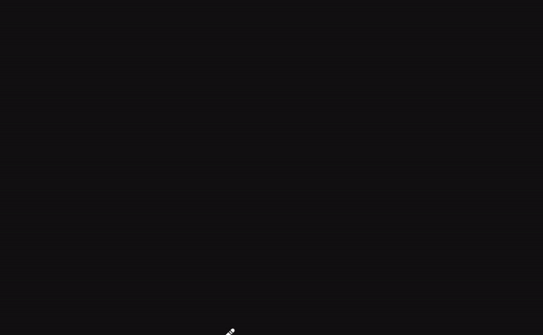

</td>
      </tr>
      <tr>
          <td><strong>Mouse down + SHIFT</strong></td>
          <td><code>custom(pencil)</code></td>
          <td>Start drawing a straight vertical or horizontal line</td>
          <td>

  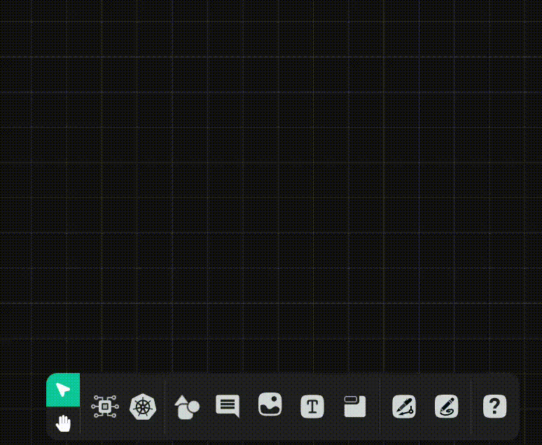

</td>
      </tr>
      <tr>
          <td><strong>Mouse up</strong></td>
          <td><code>custom(pencil)</code></td>
          <td>Complete the line and render into a styled component</td>
          <td>

  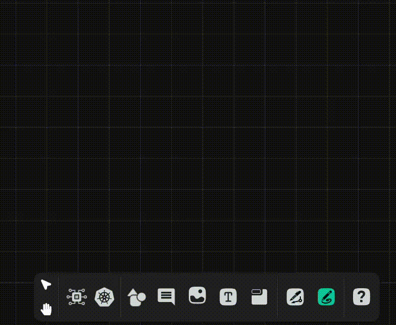

</td>
      </tr>
      <tr>
          <td><strong>Click</strong></td>
          <td><code>custom(pencil)</code></td>
          <td>Draws ink from the pencil</td>
          <td>

  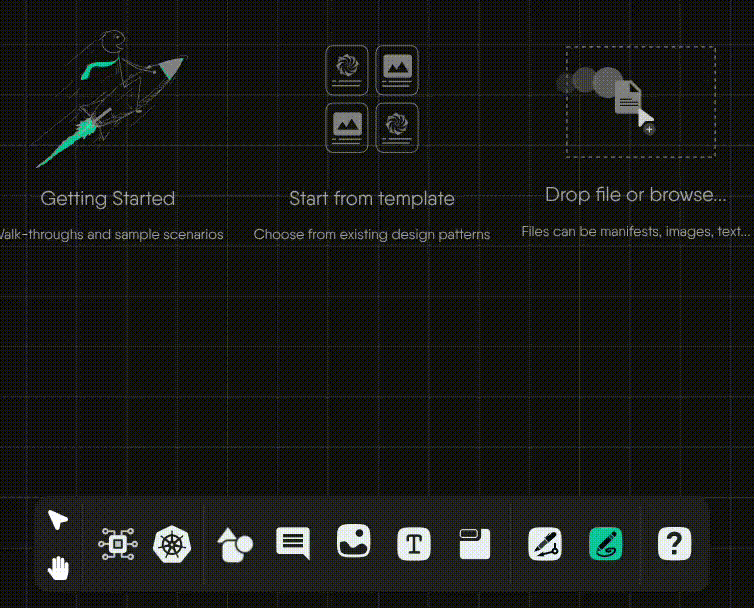

</td>
      </tr>
      <tr>
          <td><strong>Scroll wheel</strong></td>
          <td><code>custom(pencil)</code></td>
          <td>Nothing</td>
          <td>

  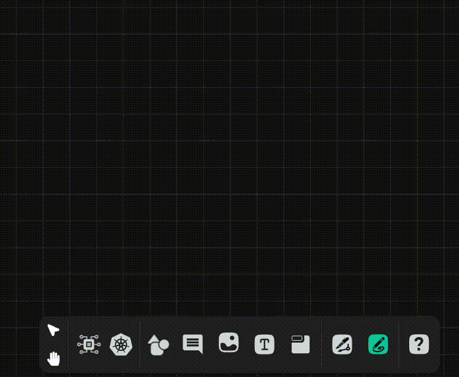

</td>
      </tr>
      <tr>
          <td><strong>Scroll wheel + CMD/CTRL</strong></td>
          <td><code>custom(pencil)</code></td>
          <td>Nothing</td>
          <td>

  

</td>
      </tr>
  </tbody>
</table>
<!-- *Developer notes:*
1. *In the future, the canvas moves with the pen/pencil as they near the edge of the viewport.*
2. *In the future, the scroll wheel will behave as it normally does in default mode.* -->

    

    

        
The Pen tool operates as a creator of annotation edges. Note that the pen tool has two behaviors depending upon the context in which you initiate the connection.

<strong>To Activate:</strong> <code>(CMD/CTRL)+E</code>

<strong>Connector Behaviors</strong>

<ul>
<li><strong>Component-connect Behavior</strong>: When you click an empty spot on the canvas, and drag to another empty spot on the canvas, you get a joint (aka a terminal node) from which you can create new connections as well as new edge relationships.</li>
<li><strong>Canvas-connect Behavior</strong>: When you click an empty spot on the canvas, and drag to an existing component, you get an annotation edge relationship.</li>
</ul>

<table>
  <thead>
      <tr>
          <th>Phase</th>
          <th>Cursor Style</th>
          <th>Behavior</th>
          <th>Example</th>
      </tr>
  </thead>
  <tbody>
      <tr>
          <td><strong>1. Click &amp; release</strong></td>
          <td><code>pen</code></td>
          <td>Initiate connection</td>
          <td>

  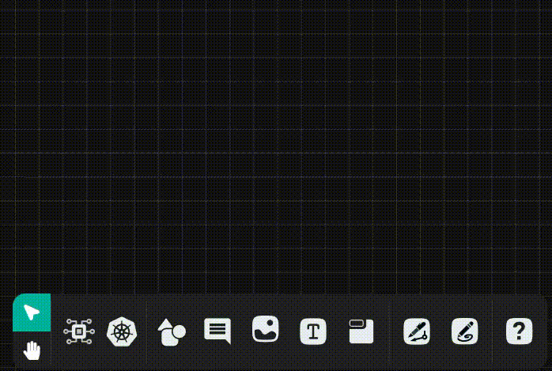

</td>
      </tr>
      <tr>
          <td><strong>2. Click-and-move</strong></td>
          <td><code>pen</code></td>
          <td>Move the ghost edge around if a connection was initiated</td>
          <td>

  

</td>
      </tr>
      <tr>
          <td><strong>3. Click while connecting</strong></td>
          <td><code>pen</code></td>
          <td>Establish and render the connection</td>
          <td>

  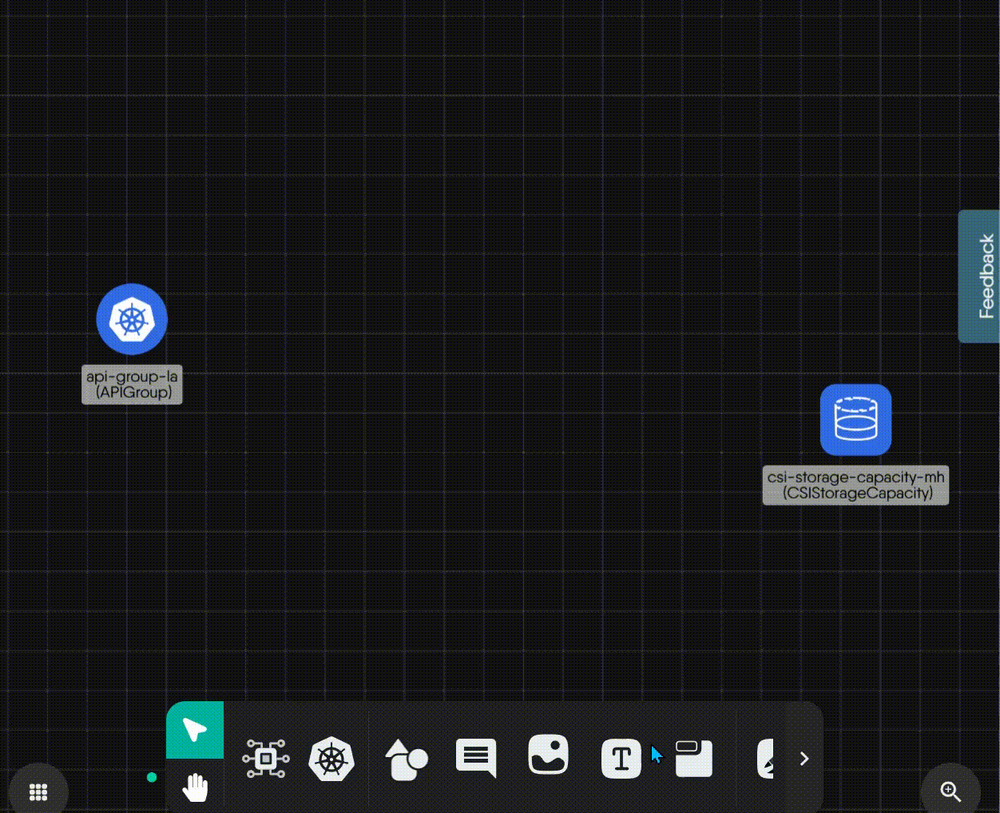

</td>
      </tr>
  </tbody>
</table>
<!--
*Developer notes:*
1. *In future, when the connector is released on an empty spot on the canvas, offer a component picker from which users can always choose a “Joint” component.*
2. *Rename PenTerminalNode to “**Joint**”, unless there’s something better to call it.*
-->

    

    

        
The table below outlines the mouse interaction modes available in <strong>Kanvas</strong> while using, detailing cursor styles and their expected behavior.

<table>
  <thead>
      <tr>
          <th>Action</th>
          <th>Cursor Style</th>
          <th>Behavior</th>
      </tr>
  </thead>
  <tbody>
      <tr>
          <td><strong>Hover</strong></td>
          <td><code>hand</code></td>
          <td>Nothing</td>
      </tr>
      <tr>
          <td><strong>Click-and-hold</strong></td>
          <td><code>grabbing-hand</code></td>
          <td>Grab the canvas and pan in the direction of mouse movement</td>
      </tr>
      <tr>
          <td><strong>Scroll wheel + CMD/CTRL</strong></td>
          <td><code>grabbing-hand</code></td>
          <td>Zoom in/out in the direction of the mouse</td>
      </tr>
      <tr>
          <td><strong>Horizontal scroll wheel</strong></td>
          <td><code>grabbing-hand</code></td>
          <td>Pan left or right in the direction of the mouse</td>
      </tr>
  </tbody>
</table>

    

