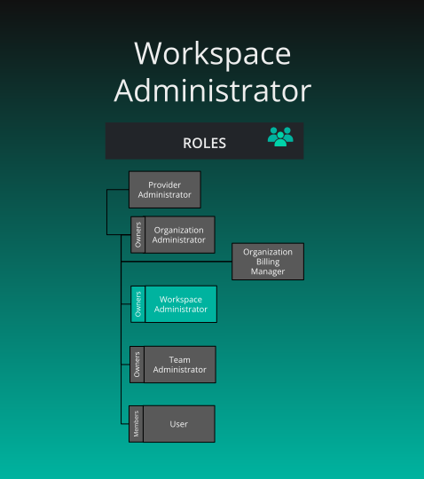

# Default Workspace Roles

> By default, Workspaces have one role available: Workspace Administrator.

    

        

      

  

      
<h2 id="workspace-administrator" class="heading-link">
  Workspace Administrator
  <a href="#workspace-administrator" class="heading-anchor" aria-label="Permalink to this heading">🔗</a>
</h2>

    

    

        
<strong>What is the purpose of this role?</strong>

<ul>
<li>Administration of a workspace along with curation of content for the organization&rsquo;s catalog (for each organization for which the user has this role assigned)</li>
</ul>

<strong>Who can assign this role?</strong>

<ul>
<li>Organization Administrators or Workspace Owner</li>
</ul>

<strong>When this role first assigned?</strong>

<ul>
<li>Creation of a new workspace</li>
</ul>

<strong>How many instances of these roles?</strong>

<ul>
<li>Min: 1, Max: many</li>
<li>By default, the first Workspace Administrator is the owner (the creator) of the Workspace.</li>
</ul>

<strong>Who can remove assignment of this role?</strong>

<ul>
<li>Organization Administrators or Workspace Owner</li>
</ul>

<strong>What permissions does this role have?</strong>

<ul>
<li>Check <a href="/pr-preview/pr-1233/cloud/reference/default-permissions/">Permissions Reference</a></li>
</ul>

      

  

