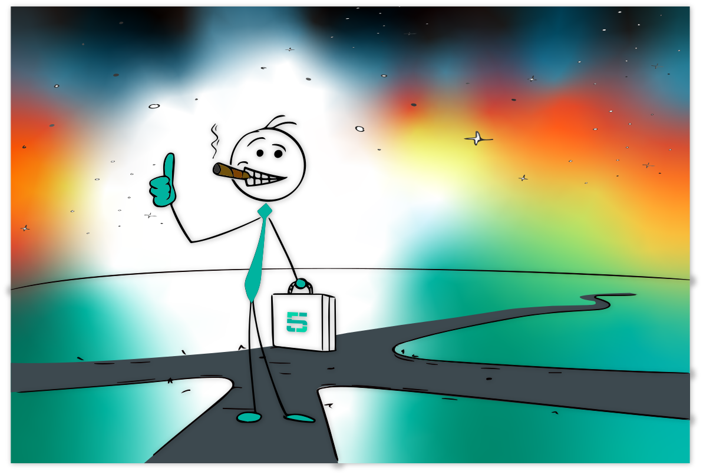
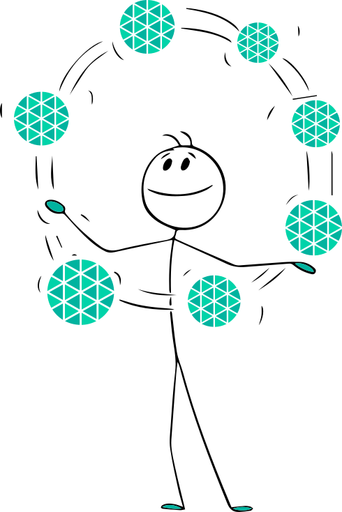
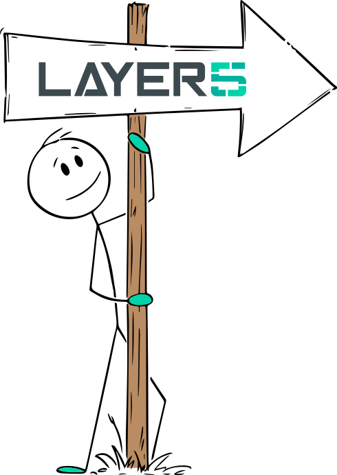
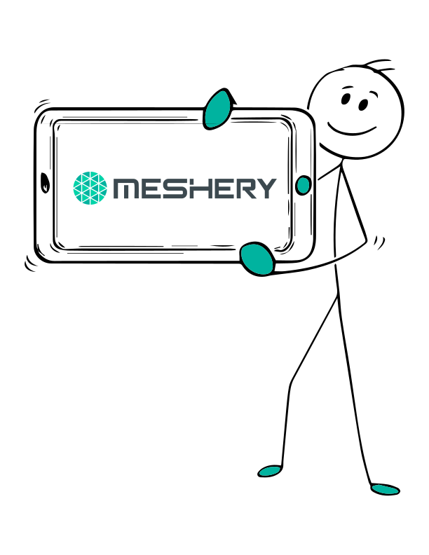
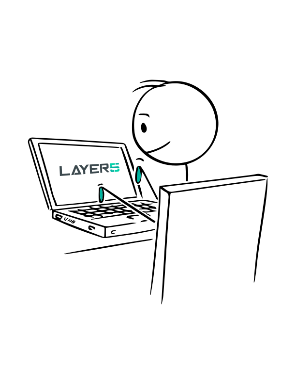

# Meet Five and the Cast

> The continuous narrative behind Layer5 Cloud documentation — Five, his team at Orbital Labs, and the cloud-native universe they inhabit.

Five is a Platform Engineer at Orbital Labs with an unshakeable belief that every problem is solvable with the right tool, the right permissions, and — ideally — access to production. He arrived at Layer5 Cloud the same way most engineers arrive at operations tooling: via a 3 AM paging incident that politely suggested he learn something new. He did. He also learned about role-based access control the hard way, but that is what the rest of these docs are for.

Orbital Labs is a cloud-native startup on the steeper part of the growth curve — the part where "we'll sort out permissions later" has finally become "we should have sorted out permissions earlier." Orbital Labs runs workloads across AWS, GCP, and a legacy Azure footprint inherited from an acquisition nobody likes to talk about. Their infrastructure is managed through Kanvas, their environments are wrangled by Five and Zara, and their Friday afternoons are protected by Maya Chen.

Orbital Labs operates as a tenant of Constellation Cloud, an MSP whose Provider Admin, Dr. Aiko Sato, manages their account alongside a roster of other organizations — including Stellar Dynamics, Orbital Labs' largest enterprise client. Stellar Dynamics has a Fortune 500 budget, a legacy-everything architecture, and Marcus Webb, an Org Admin who CC's his VP on support tickets. The relationship is productive. Mostly.

## The Organizations

      <strong>Constellation Cloud</strong>
    

    

        
<strong>Type:</strong> Managed Service Provider 
<strong>Plan:</strong> Enterprise 
<strong>Role in this narrative:</strong> Provider — manages Orbital Labs and Stellar Dynamics as tenants

<em>&ldquo;We keep the lights on so you don&rsquo;t have to.&rdquo;</em>

      

  

      <strong>Orbital Labs</strong>
    

    

        
<strong>Type:</strong> Cloud-native startup 
<strong>Plan:</strong> Team 
<strong>Role in this narrative:</strong> Five&rsquo;s employer — primary protagonist organization

<em>&ldquo;Moving fast and occasionally breaking staging.&rdquo;</em>

      

  

      <strong>Stellar Dynamics</strong>
    

    

        
<strong>Type:</strong> Enterprise client 
<strong>Plan:</strong> Enterprise 
<strong>Role in this narrative:</strong> Orbital Labs&rsquo; biggest customer — illustrates cross-org access and enterprise entitlements

<em>&ldquo;Fortune 500, cloud-native ambitions, legacy everything.&rdquo;</em>

      

  

## The Cast

### Constellation Cloud

      <strong>Dr. Aiko Sato</strong> — Provider Admin
    

    

        

<strong>Organization:</strong> Constellation Cloud 
<strong>Role:</strong> Provider Admin 
<strong>Plan:</strong> Enterprise

Has seen every misconfigured RBAC policy known to humankind. Responds to Slack messages with bullet-pointed summaries because prose is inefficient.

      

  

### Orbital Labs

      <strong>Five</strong> — Platform Engineer
    

    

        

<strong>Organization:</strong> Orbital Labs 
<strong>Role:</strong> User (Platform Engineer) 
<strong>Plan:</strong> Team

The protagonist — curious, enthusiastic, and reliably the first to discover that a feature works differently than the docs say it does.

      

  

      <strong>Maya Chen</strong> — Org Admin &amp; Development Team Admin
    

    

        

<strong>Organization:</strong> Orbital Labs 
<strong>Role:</strong> Org Admin + Development Team Admin 
<strong>Plan:</strong> Team

Voice of reason. Has a calendar block called &ldquo;Preventing Five from touching prod&rdquo; that recurs every Friday at 4:45 PM. (Org Admins may also administer teams; Maya does both.)

      

  

      <strong>Zara Osei</strong> — Infrastructure Team Admin
    

    

        

<strong>Organization:</strong> Orbital Labs 
<strong>Role:</strong> Team Admin, Infrastructure Team 
<strong>Plan:</strong> Team

Sole keeper of the keychain permission matrix. Responds to access requests with a 48-hour SLA and a knowing look.

      

  

      <strong>Rex Park</strong> — Developer
    

    

        

<strong>Organization:</strong> Orbital Labs 
<strong>Role:</strong> User, Developer Team 
<strong>Plan:</strong> Team

Opens design review requests and immediately asks Five if they have been approved yet. Deploys with confidence; reads error logs with less.

      

  

      <strong>Jordan Reyes</strong> — Developer &amp; Designer
    

    

        

<strong>Organization:</strong> Orbital Labs 
<strong>Role:</strong> User, Developer Team 
<strong>Plan:</strong> Team

Crafts Kanvas designs of alarming elegance. Considers a 47-component architecture diagram &ldquo;a rough draft.&rdquo;

      

  

### Stellar Dynamics

      <strong>Marcus Webb</strong> — Org Admin
    

    

        

<strong>Organization:</strong> Stellar Dynamics 
<strong>Role:</strong> Org Admin 
<strong>Plan:</strong> Enterprise

Files support tickets with executive summaries, numbered findings, and a risk matrix. CC&rsquo;s his VP on all of them.

      

  

## Team & Org Hierarchy

| Organization | Team | Members | Roles |
|---|---|---|---|
| Constellation Cloud | — | Dr. Aiko Sato | Provider Admin |
| Orbital Labs | Infrastructure | Five, Zara Osei | Team Admin (Zara), User (Five) |
| Orbital Labs | Development | Maya Chen, Rex Park, Jordan Reyes | Team Admin (Maya), User (Rex, Jordan) |
| Stellar Dynamics | Platform | Marcus Webb | Org Admin (Marcus) |

## Seed Inventory

Use these canonical names in all screenshots, tutorials, and example walkthroughs. Do not invent alternate names for these resources in other docs pages.

### Workspaces

| Workspace | Owner Org | Teams with Access | Purpose in Docs |
|---|---|---|---|
| `orbital-production` | Orbital Labs | Infrastructure | Prod access controls, environment assignment demos |
| `orbital-staging` | Orbital Labs | Infrastructure, Development | Cross-team workspace sharing demos |
| `orbital-dev` | Orbital Labs | Development | Team-scoped workspace, design iteration tutorials |
| `stellar-main` | Stellar Dynamics | Platform | Enterprise org, cross-org access scenarios |

### Environments

| Environment | Workspace | Connections | Purpose in Docs |
|---|---|---|---|
| `prod-aws` | orbital-production | EKS, RDS (PostgreSQL), S3, CloudFront, SQS | Prod demos; managed AWS service connections |
| `prod-gcp` | orbital-production | GKE, Cloud SQL, Cloud Storage, Pub/Sub | Multi-cloud prod; GCP service connections |
| `staging-aws` | orbital-staging | EKS, S3, ElastiCache | Cross-team staging; feature branch deployments |
| `staging-azure` | orbital-staging | AKS, Azure Blob Storage, Azure Service Bus | Azure connections; Stellar Dynamics mirror environment |
| `dev-local` | orbital-dev | local k8s (kind), LocalStack (AWS emulation) | Getting-started tutorials; no cloud credentials required |
| `stellar-enterprise` | stellar-main | AKS, Azure SQL, Azure API Management, Azure AD | Enterprise entitlements; cross-org access demos |

### Designs

| Design | Owner | Workspace | Cloud Services | Purpose in Docs |
|---|---|---|---|---|
| `microservices-baseline` | Jordan Reyes | orbital-dev | local/kind only | Tutorial: creating and sharing a design |
| `api-platform-aws` | Five | orbital-production | EKS + API Gateway + Lambda + RDS + S3 | Tutorial: deploying a multi-service AWS workload |
| `data-pipeline-gcp` | Zara Osei | orbital-production | GKE + Pub/Sub + BigQuery + Cloud Storage + Dataflow | GCP-native service design; environment assignment |
| `frontend-cdn-azure` | Rex Park | orbital-staging | AKS + Azure Front Door + Azure Blob + Azure CDN | Azure workload; staging → prod promotion |
| `stellar-saas-platform` | Marcus Webb | stellar-main | AKS + Azure SQL + Azure API Management + Azure AD + Event Hub | Cross-org design access; enterprise entitlements |
| `prod-deployment-v2` | Five | orbital-production | EKS + RDS + S3 + CloudFront | Tutorial: promoting a design from staging to prod |

## Using This Narrative

  <h4 class="alert-heading" style="color: #3772ff;">For Documentation Contributors</h4>
  
      
The characters, organizations, workspaces, environments, and designs on this page are the canonical reference for all Layer5 Cloud and Kanvas documentation. When writing new docs, updating screenshots, or building tutorials, use these names and scenarios rather than inventing new examples.

See the <a href="five-narrative-plan">Five Narrative Research Plan</a> for a section-by-section map of where each character and scenario belongs, which Five illustrations to use, and screenshot conventions.

  

