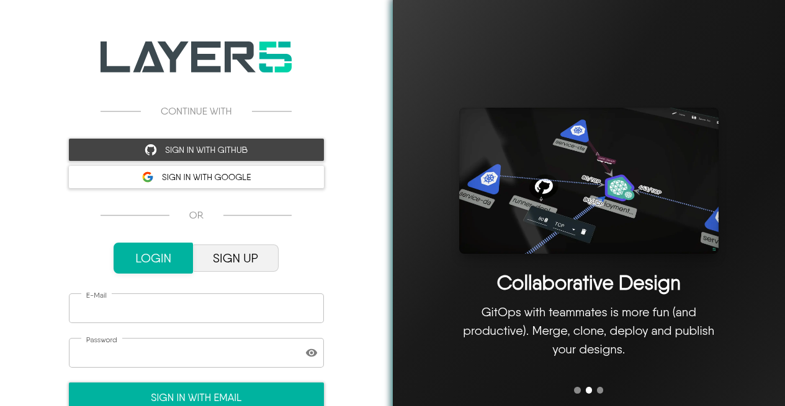

# Getting Started with Designs

> Learn how to create, import, and share cloud native infrastructure designs in Kanvas — from your first design to deployable architecture.

  <h4 class="alert-heading" style="color: #3772ff;">Follow Along with Jordan and Five</h4>
  
      Throughout the Kanvas docs, you&rsquo;ll follow <strong>Jordan Reyes</strong> — a developer and designer at Orbital Labs — as she creates, shares, and iterates on infrastructure designs. <strong>Five</strong> reviews her work and occasionally discovers that a design works better in practice than it does in theory. Their starting point is the <code>microservices-baseline</code> design in the <code>orbital-dev</code> workspace. <a href="/pr-preview/pr-1251/cloud/getting-started/meet-five/">Meet the full cast →</a>
  

## Sign in

Kanvas can be explored anonymously, but saving to your account, sharing with teammates, and deploying require sign-in.

<figure>
  
  <figcaption>Sign-in page: continue with GitHub or Google, or log in with email.</figcaption>
</figure>

## Start here

1. [Starting from scratch](/pr-preview/pr-1251/kanvas/getting-started/starting-scratch/) — open Designer and create your first design.
2. [Importing a Design](/pr-preview/pr-1251/kanvas/getting-started/import-designs/) — bring in Kubernetes, Helm, Compose, or existing Meshery designs.
3. [Working with Components](/pr-preview/pr-1251/kanvas/getting-started/working-with-components/) — configure, copy, and arrange components on the canvas.
4. [Creating Relationships](/pr-preview/pr-1251/kanvas/getting-started/creating-relationships/) — connect components with context-aware edges.

Choose **Designer** when you are authoring infrastructure; switch to **Operator** when you are inspecting live clusters. See the [Kanvas overview](/pr-preview/pr-1251/kanvas/) for the mode chooser.

## Use Kanvas for your diagrams

      Dev Env Documentation
    

    

        
The dev environment is an often overlooked but critical part of an organization&rsquo;s infrastructure. Knowing what clusters and services are used, how to run and test services locally, and how to troubleshoot are critical parts for getting a team up and running quickly. With Kanvas, you can easily embed designs into your How To and Getting Started guides, making it easy to create, maintain and update concise documentation.

      

  

      Migrations and Rollbacks
    

    

        
Migrations and rollbacks are some of the most important things to get right when they&rsquo;re needed. By making it easy to create, find, and reference these documents and diagrams, you can be confident that your processes will be understood and your knowledge up to date.

      

  

      Deployment Pipeline
    

    

        
Kanvas keyboard shortcuts and preset icons make it easy to create beautiful, informative designs that explain every aspect of your deploy, test, and monitor pipeline. Embed several designs in one document to cover all of your different services, vendors, and data stores.

      

  

