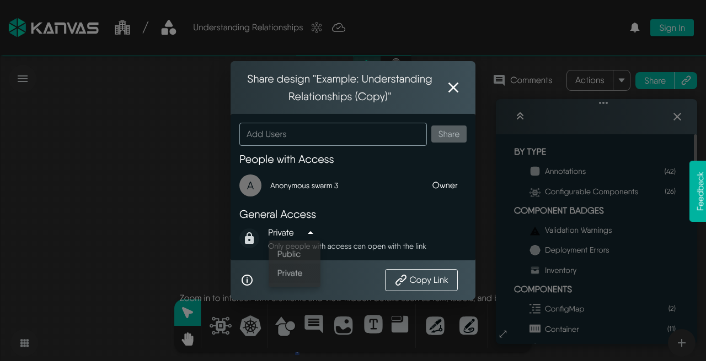
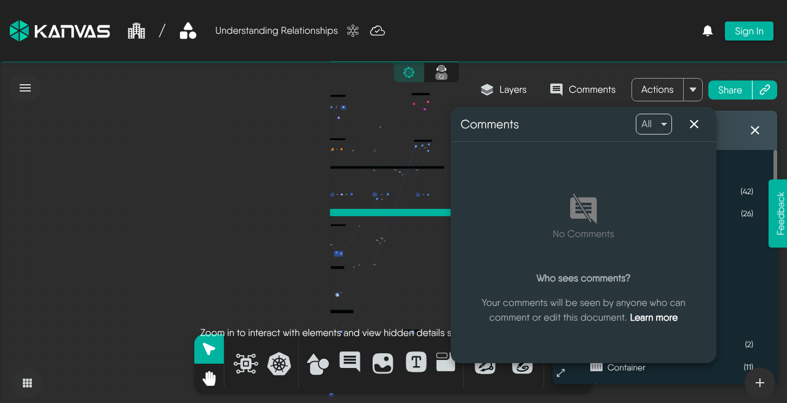

# Collaborative Editing

> Share a Kanvas design, set Private or Public visibility, invite collaborators, leave review comments, and understand what to expect from live collaboration.

Kanvas Designer supports team collaboration on infrastructure designs: you can share access, control who can open a design, review with inline comments, and work alongside teammates when they join the same design. This tutorial walks through a practical share-and-review flow on [kanvas.new](https://kanvas.new).

For deeper reference, see [Sharing Designs](/pr-preview/pr-1251/kanvas/designer/sharing/) and [Reviewing Designs](/pr-preview/pr-1251/kanvas/designer/comments/).

## What you will do

1. Open a design in Designer and share it
2. Choose **Private** or **Public** visibility and invite people
3. Copy a share link and verify **People with Access**
4. Leave comments for design review
5. Set honest expectations for live collaborators (cursors / presence)

## Prerequisites

- Access to [Kanvas Designer](https://kanvas.new) (anonymous browsing works for Share on Designer; sign in for full identity, invites, and catalog flows)
- A design you own or can edit (clone a sample design if you are starting fresh)
- Optional: a teammate's Layer5 Cloud username or email to invite

  <h4 class="alert-heading" style="color: #3772ff;">Designer vs Operator Share</h4>
  
      This tutorial covers <strong>Designer</strong> designs. Designer Share works for anonymous sessions on hosted Kanvas. Operator view Share can fail when no Kubernetes context / view is loaded — do not assume the same share UX in Operator.
  

## Step 1: Open your design in Designer

1. Go to [kanvas.new](https://kanvas.new) and open **Designer** (center mode toggle).
2. Open an existing design from **File → Open…**, or clone a sample design and rename it.
3. Confirm the design name and autosave indicator appear in the top bar.

You are ready to share when the canvas has loaded and the top-bar **Share** control is available.

## Step 2: Open Share and review access

Open the Share modal in either of these ways:

1. Click **Share** in the Designer top bar (near Comments and Actions), or
2. Open **File** and choose **Share**

In the Share modal you should see:

- **Add Users** — invite people by name or email
- **People with Access** — authoritative list of who can open the design
- **Private / Public** — overall visibility
- **Copy Link** — shareable URL to the design

<figure>
  
  <figcaption>Designer Share: Add Users, People with Access, Private/Public, and Copy Link</figcaption>
</figure>

  <h4 class="alert-heading" style="color: #EBC017;">People with Access is the source of truth</h4>
  
      After every grant or revoke, re-open <strong>Share</strong> and confirm the <strong>People with Access</strong> list. Treat that list as authoritative — do not rely on a toast alone. See <a href="/pr-preview/pr-1251/kanvas/designer/sharing/">Sharing Designs</a>.
  

## Step 3: Set visibility (Private vs Public)

Choose visibility that matches how broadly you want the design reachable:

| Visibility | Who can reach it | Typical use |
|------------|------------------|-------------|
| **Private** | You (owner) plus people or teams you explicitly grant | Drafts, internal review, limited collaboration |
| **Public** | Anyone with the link (and discoverable public channels) | Broad feedback, demos, open templates |

Notes:

- **Copy Link** works for both Private and Public designs.
- For **Private** designs, the link alone is not enough — recipients must also appear under **People with Access**.
- **Published** (Catalog) is a separate lifecycle from Private/Public share. Publishing is covered in [Publishing to Catalog](/pr-preview/pr-1251/kanvas/tutorials/publishing-to-catalog/) and [Publishing Designs](/pr-preview/pr-1251/kanvas/designer/publishing-designs/).

## Step 4: Invite collaborators

1. In **Add Users**, type a username or email and select the person (or team, when available).
2. Confirm they appear under **People with Access**.
3. Optionally **Copy Link** and send it so they can open the design quickly.

Owner vs collaborator capabilities (summary):

- **Owner** — full control: edit, share, change visibility, delete
- **Collaborator** — can view and edit the design content; cannot delete the design, re-share it, or change overall visibility

Full detail: [Sharing Designs — Owner vs Collaborator](/pr-preview/pr-1251/kanvas/designer/sharing/).

## Step 5: Review with comments

Comments are the primary async review tool on the canvas.

1. Open the **Comments** panel from the top bar, or use the **Comments** tool on the bottom dock.
2. Add a comment via the dock, context-click → **Add a Comment**, or the <button class="kbc-button kbc-button-xs">M</button> hotkey.
3. Pin feedback to a specific component or canvas area; use `@` mentions when you need someone's attention.
4. Resolve threads when discussion is done (prefer resolve over delete so history remains).

<figure>
  <!-- Prefer a signed-in comments thread screenshot when available; audit capture shows empty Comments panel with docs learn-more link. -->
  
  <figcaption>Comments panel in Designer (empty state includes a learn-more link to the comments docs)</figcaption>
</figure>

<!-- SCREENSHOT: Signed-in comment thread with @mention and Resolve — replace designer-comments.png empty-state shot when available. Source candidate: /workspace/kanvas-docs-audit/screenshots/designer-comments.png -->

Deep dive: [Reviewing Designs](/pr-preview/pr-1251/kanvas/designer/comments/).

## Step 6: Live collaborators — what to expect

Kanvas includes real-time collaboration in the product (presence / awareness cursors and join-leave signaling via Cloud collaboration). When another collaborator has the **same design** open:

- You may see collaborator avatars or presence indicators in the designer chrome
- Live peer cursors can appear on the canvas while others edit

  <h4 class="alert-heading" style="color: #7A848E;">Live multiplayer cursors</h4>
  
      Peer cursors require other signed-in collaborators on the same design. An anonymous solo session will not show multiplayer cursors. Do not treat marketing multi-cursor imagery as a guarantee of what you will see in every session.
  

<!-- SCREENSHOT: Two signed-in users on the same design showing peer cursors / collaborator avatars. Not confirmed in anonymous audit browse — capture when available; do not invent. -->

Practical tips while collaborating live:

1. Agree who owns structural changes (large layout moves) vs configuration edits.
2. Use comments for decisions that should persist after the session.
3. Re-check **People with Access** if someone cannot open the design.
4. Prefer **Private + explicit invites** for sensitive architectures; use **Public** only when link-wide access is intentional.

## Recap

| Goal | Where in Kanvas |
|------|-----------------|
| Invite people / set Private·Public / copy link | Top bar **Share** (or **File → Share**) |
| Confirm grants | Share → **People with Access** |
| Async review | **Comments** panel / dock / <button class="kbc-button kbc-button-xs">M</button> |
| Catalog publish (separate from Share) | **File → Details → Publish to Catalog** |

## Related reading

- [Sharing Designs](/pr-preview/pr-1251/kanvas/designer/sharing/)
- [Reviewing Designs (Comments)](/pr-preview/pr-1251/kanvas/designer/comments/)
- [Publishing Designs](/pr-preview/pr-1251/kanvas/designer/publishing-designs/)
- Tutorial: [Publishing to Catalog](/pr-preview/pr-1251/kanvas/tutorials/publishing-to-catalog/)

