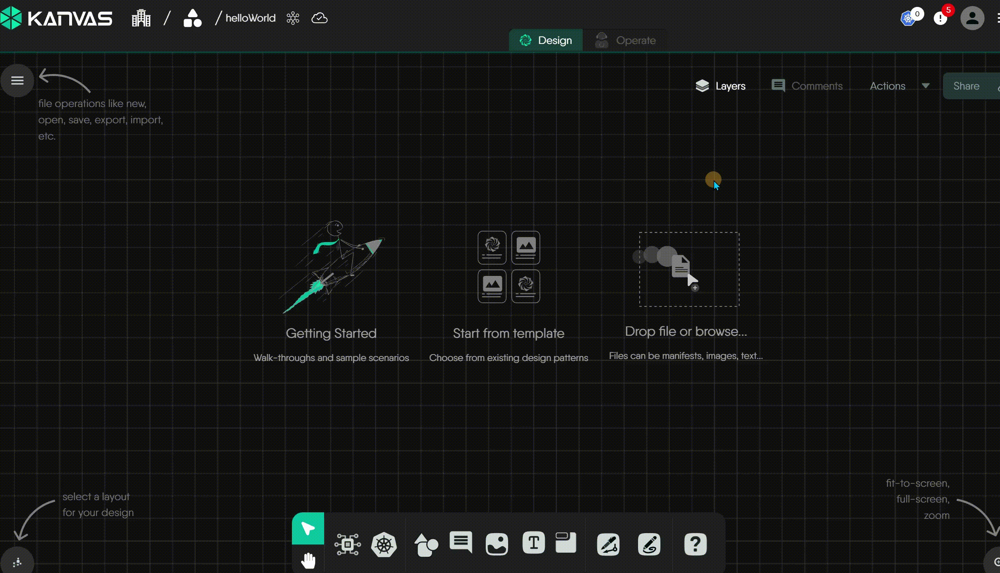
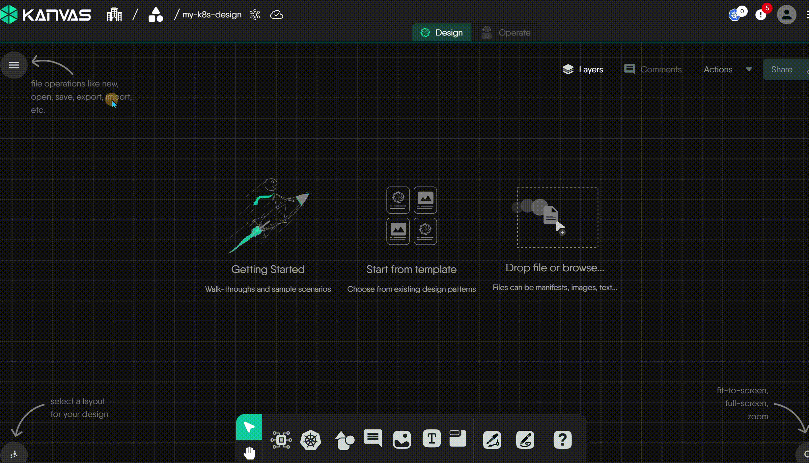
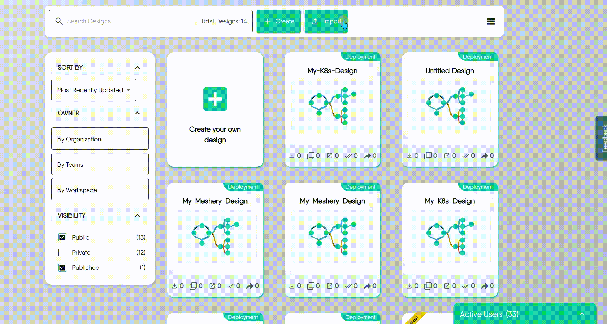

# Importing a Design

> Learn how to import designs from various sources and formats, including Kubernetes manifests, Helm charts, Docker Compose files, and more.

[Kanvas](https://kanvas.new) acts as a powerful bridge, enabling you to import your existing application and infrastructure configurations from a wide variety of standard formats. It transforms these configurations into visual, editable, deployable, and shareable designs. This guide covers how to import designs, the supported formats, and important considerations.

## Accessing the Import Functionality

There are multiple ways to import a design.

<ul class="nav nav-tabs" id="tabs-0" role="tablist">
  <li class="nav-item">
      <button class="nav-link active"
          id="tabs-00-00-tab" data-bs-toggle="tab" data-bs-target="#tabs-00-00" role="tab"
          data-td-tp-persist="drag and drop" aria-controls="tabs-00-00" aria-selected="true">
        Drag and Drop
      </button>
    </li><li class="nav-item">
      <button class="nav-link"
          id="tabs-00-01-tab" data-bs-toggle="tab" data-bs-target="#tabs-00-01" role="tab"
          data-td-tp-persist="from kanvas toolbar" aria-controls="tabs-00-01" aria-selected="false">
        From Kanvas Toolbar
      </button>
    </li><li class="nav-item">
      <button class="nav-link"
          id="tabs-00-02-tab" data-bs-toggle="tab" data-bs-target="#tabs-00-02" role="tab"
          data-td-tp-persist="from layer5 cloud" aria-controls="tabs-00-02" aria-selected="false">
        From Layer5 Cloud
      </button>
    </li><li class="nav-item">
      <button class="nav-link"
          id="tabs-00-03-tab" data-bs-toggle="tab" data-bs-target="#tabs-00-03" role="tab"
          data-td-tp-persist="via github integration" aria-controls="tabs-00-03" aria-selected="false">
        Via GitHub Integration
      </button>
    </li>
</ul>

    

        
You can drag a file from your local computer directly onto the Kanvas canvas to import a design.

  

    

    

        
The most direct method is to click the <strong>hamburger menu</strong> (☰) in the top-left corner, then select the &ldquo;Import&rdquo; button in the Kanvas toolbar.

  

    

    

        
Navigate to the <a href="https://cloud.layer5.io/catalog/content/my-designs">My Designs</a> page and click the &ldquo;Import&rdquo; button.

  

    

    

        
For a more advanced, repository-based workflow, you can establish a persistent connection between your GitHub account and Meshery. This allows you to browse your repositories and import multiple designs directly.

<blockquote>

Learn more about <a href="/pr-preview/pr-1275/cloud/getting-started/github-integration/">GitHub integration</a>.

</blockquote>

    

  <h4 class="alert-heading" style="color: #3772ff;">Recommendation: Use Kanvas Import</h4>
  
      For the most flexibility, we recommend initiating the import from within Kanvas. This interface gives you the option to either import the configuration as a brand-new design or merge it into a design you currently have open.
  

## Importing by Infrastructure Type

Kanvas supports a diverse set of infrastructure types and packaging formats. The following sections provide detailed requirements and instructions for each.

  <h4 class="alert-heading" style="color: #3772ff;">Cannot Import Folders Directly</h4>
  
      You can&rsquo;t directly import folders. If your infrastructure definition (like Kustomize or Helm) is in a folder, you must compress it into a single archive file before uploading.
  

<ul class="nav nav-tabs" id="tabs-3" role="tablist">
  <li class="nav-item">
      <button class="nav-link active"
          id="tabs-03-00-tab" data-bs-toggle="tab" data-bs-target="#tabs-03-00" role="tab"
          data-td-tp-persist="from kubernetes manifests" aria-controls="tabs-03-00" aria-selected="true">
        From Kubernetes Manifests
      </button>
    </li><li class="nav-item">
      <button class="nav-link"
          id="tabs-03-01-tab" data-bs-toggle="tab" data-bs-target="#tabs-03-01" role="tab"
          data-td-tp-persist="from a helm chart" aria-controls="tabs-03-01" aria-selected="false">
        From a Helm Chart
      </button>
    </li><li class="nav-item">
      <button class="nav-link"
          id="tabs-03-02-tab" data-bs-toggle="tab" data-bs-target="#tabs-03-02" role="tab"
          data-td-tp-persist="from docker compose" aria-controls="tabs-03-02" aria-selected="false">
        From Docker Compose
      </button>
    </li><li class="nav-item">
      <button class="nav-link"
          id="tabs-03-03-tab" data-bs-toggle="tab" data-bs-target="#tabs-03-03" role="tab"
          data-td-tp-persist="from a design" aria-controls="tabs-03-03" aria-selected="false">
        From a Design
      </button>
    </li>
</ul>

    

        
Importing from a Kubernetes manifest is the most direct way to bring your existing configurations into Kanvas. This method is suitable for any standard <code>.yaml</code> or <code>.yml</code> file that conforms to the Kubernetes API specification, as well as for projects managed by Kustomize.

<strong>1. Importing Plain Kubernetes Manifests:</strong> If you have Kubernetes configurations available as standard manifest files, you can import them directly.

<ul>
<li><strong>Supported Packaging Formats:</strong> A standard <code>.yaml</code> or <code>.yml</code> file containing one or more Kubernetes resource definitions.</li>
</ul>

<strong>2. Importing a Kustomize Project:</strong> If you manage your Kubernetes configurations with Kustomize, a popular template-free tool for customization, you can import your entire project.

A key requirement when importing a Kustomize project is that you <strong>must provide the entire project directory</strong>, not just the <code>kustomization.yaml</code> file. This is because the <code>kustomization.yaml</code> file only contains instructions and references to other base manifest files. To correctly render the final configuration, Kanvas needs access to all of these related files.

<ul>
<li><strong>Supported Packaging Formats:</strong> A archive (such as <code>.zip</code>, <code>.tar</code>, or <code>.tar.gz</code>) containing the complete Kustomize project directory. This archive must include the <code>kustomization.yaml</code> file and all of its referenced resources.</li>
</ul>

    

    

        
Helm is the standard package manager for Kubernetes. Importing a Helm chart into Kanvas allows you to visualize, manage, and customize complex applications. To ensure a successful import, you must provide the complete packaged chart. Importing individual chart files like <code>Chart.yaml</code> or <code>values.yaml</code> is not supported.

<ul>
<li><strong>Supported Packaging Formats:</strong>
<ul>
<li><strong>Chart Archive (<code>.tgz</code>, <code>.tar</code>, or <code>.tar.gz</code>):</strong> The standard gzipped tarball format for distributing Helm charts.</li>
<li><strong>OCI Artifact:</strong> A modern packaging standard. When exported as a file for upload, this can be imported via an <code>oci://</code> URI from a container registry.</li>
</ul>
</li>
</ul>

    

    

        
This import method provides a convenient bridge for developers looking to migrate their applications from a local Docker-based environment to Kubernetes. Kanvas will parse your <code>docker-compose.yaml</code> file and automatically translate your services into their equivalent Kubernetes resources.

<ul>
<li><strong>Supported Packaging Formats:</strong> A standard <code>.yaml</code> or <code>.yml</code> file. For best compatibility, ensure your Compose file includes a <code>version</code> key (e.g., <code>version: '3.8'</code>) at the top level.</li>
</ul>

    

    

        
This is Meshery&rsquo;s native format and provides a lossless way to save and import your designs. It preserves all of an application&rsquo;s component configurations as well as the visual layout, annotations, and metadata from the Kanvas designer.

<ul>
<li><strong>Supported Packaging Formats:</strong>
<ul>
<li><strong>YAML File (<code>.yml</code>):</strong> The standard, human-readable file generated when you export a design.</li>
<li><strong>OCI Artifact:</strong> Designs can also be packaged as OCI artifacts, allowing them to be versioned and distributed via container registries.</li>
</ul>
</li>
</ul>

    

## Frequently Asked Questions

  
What happens if I drag and drop multiple files onto Kanvas at once?

  
Each supported file will be imported as a separate, new design. For example, if you drag three different Kubernetes manifest files onto Kanvas, three distinct designs will be created.

  
What happens if I select multiple files in the File Upload dialog?

  
The "File Upload" dialog is designed to process one file or package at a time. If you select multiple files in your operating system's file browser, only the last file in the selection will be processed for import. To import from multiple files, please import them individually.

  
After importing a file, can I download my original, unaltered file?

  
No. When a file is imported, it is converted into a native Design. The original source file is not stored and cannot be downloaded later. The export function will generate a new file based on the **current** state of your design.
> For more details, see the [Exporting Designs](/pr-preview/pr-1275/kanvas/designer/export-designs/) guide.

  
When I import from a Kubernetes manifest, Helm chart, or other type, and choose to merge this file into an existing design, can I download my original file?

  
When you choose to **merge** a new design into an existing one, Meshery first creates a separate design from your imported file before performing the merge. You can find this newly created design on your [My Designs](https://cloud.layer5.io/catalog/content/my-designs) page.

  
Are there any differences, limitations, or special requirements for importing via File Upload, URL, or the GitHub Integration?

  
Yes. File Upload and URL Import are simple, one-time actions for importing a single design. In contrast, the **GitHub Integration** creates a deep, persistent connection to your GitHub account.

It requires you to authorize the Meshery GitHub App, which then allows you to browse your repositories and select designs directly from the Meshery UI. Most importantly, this integration can enable a GitOps workflow by adding a GitHub Action to your repository that provides visual snapshots of design changes in your pull requests.

  
Can I import a design from GitLab or Bitbucket?

Not as a repository connection. GitHub is the only source-code host Meshery integrates with directly: it is the only repository connection kind the platform defines, and the import form itself offers just two upload methods, **File Upload** and **URL Import**.

You can still bring in a design that lives in GitLab or Bitbucket, by either route:

- **URL Import** - give the import form a direct URL to the raw file. It must serve the file body itself, not a web page that renders it, and it must be reachable from the public internet.
- **File Upload** - download the file from your repository first, then upload it. This is the route to use for a self-hosted or otherwise private GitLab or Bitbucket server, which Meshery cannot reach.

What you do not get on either route is the persistent, repository-wide connection the GitHub integration provides - browsing repositories from the Meshery UI, and the GitOps workflow that posts visual snapshots of design changes onto pull requests.

  
Is there a file size limit for imported designs?

  
There is no strict limit on the file size itself (e.g., in MB). However, there are limits on the number of **components** a design can contain, which is determined by your current subscription plan. Free accounts are limited to 100 components.

If you attempt to import a design that contains more components than your plan allows, the import will fail with a message stating that the component limit has been exceeded.
> Learn more about [plans](https://layer5.io/pricing).

