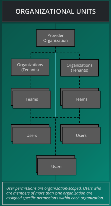

# Organizations

> Organizations serve as the fundamental component of multi-tenancy within the Layer5 Cloud.

Organizations are the basic unit of multi-tenancy — and the core security boundary — inside of Layer5 Cloud. Everything else (teams, workspaces, roles, keychains, and keys) composes on top of the organization, and resources, billing, and access control are isolated per organization. Organizations can have any number of teams. Teams can have any number of users. Users can belong to any number of teams. Users may belong to any number of organizations.

Outside of grouping users together, teams offer control access to workspaces and to workspace resources such as environments and managed and unmanaged connections

An organization plays one of two roles: a **Provider Organization** — the single top-level organization that operates the deployment and owns its default identity providers — or a **Tenant Organization**, every other organization that runs on top. A tenant can then be configured in one of three named ways (Hosted, Branded, or White-Label) depending on the domain it uses and which identity provider authenticates its users. For the full catalog and how to choose between them, see [Organization Configuration Scenarios](/cloud/guides/organizations/configuration-scenarios/).

## Example: The Orbital Labs Ecosystem

The following organizations illustrate how multi-tenancy works across provider, startup, and enterprise tiers. Follow along in the rest of the docs using [Five and the cast at Orbital Labs](/pr-preview/pr-1276/cloud/getting-started/meet-five/).

      <strong>Constellation Cloud</strong> — Provider
    

    

        
<strong>Type:</strong> Managed Service Provider 
<strong>Plan:</strong> Enterprise 
<strong>Provider Admin:</strong> Dr. Aiko Sato

Constellation Cloud manages multiple tenant organizations, including Orbital Labs and Stellar Dynamics. As the provider, it controls the top-level entitlement configuration for all tenants.

<em>&ldquo;We keep the lights on so you don&rsquo;t have to.&rdquo;</em>

      

  

      <strong>Orbital Labs</strong> — Startup Tenant
    

    

        
<strong>Type:</strong> Cloud-native startup 
<strong>Plan:</strong> Team 
<strong>Org Admin:</strong> Maya Chen

Orbital Labs is a tenant of Constellation Cloud. Users at Orbital Labs belong to one or more teams (Infrastructure, Development) and access workspaces within their organization.

<em>&ldquo;Moving fast and occasionally breaking staging.&rdquo;</em>

      

  

      <strong>Stellar Dynamics</strong> — Enterprise Tenant
    

    

        
<strong>Type:</strong> Enterprise client 
<strong>Plan:</strong> Enterprise 
<strong>Org Admin:</strong> Marcus Webb

Stellar Dynamics is a separate tenant of Constellation Cloud and an enterprise client of Orbital Labs. Users at Stellar Dynamics can be granted access to specific Orbital Labs workspaces and designs via cross-org access controls.

<em>&ldquo;Fortune 500, cloud-native ambitions, legacy everything.&rdquo;</em>

      

  

### Cross-Organization Access

Users of one organization may be granted access to resources (workspaces, designs) in another organization. Entitlements are org-scoped: the permissions a user has in Orbital Labs do not automatically apply in Stellar Dynamics, and vice versa.

Cross-organization access works through **resource-access mappings** — a grant attached to an individual resource (such as a single design) that names the user it is shared with. These mappings **deliberately cross the organization boundary**: a user does *not* need to be a member of an organization to open a resource that has been shared with them there. For example, when Maya at Orbital Labs shares the `stellar-saas-platform` design with Marcus at Stellar Dynamics, Marcus can open that one design even though he is not a member of Orbital Labs. This is intentional — it is the mechanism that makes cross-org collaboration possible — and it is distinct from organization membership and from the org-scoped roles described below. Sharing a single resource grants access to *that resource only*; it does not make the recipient a member of the organization or grant them any of its other resources.

  <h4 class="alert-heading" style="color: #3772ff;">Info</h4>
  
      Identity and authorization are decided by a combination of mechanisms, not by organization membership alone. For how the connected identity provider, org-scoped roles, and resource-access mappings fit together — and what counts as a security boundary — see <a href="/pr-preview/pr-1276/cloud/concepts/identity-and-security/#security-boundaries">Identity and Security → Security Boundaries</a>.
  

  <h4 class="alert-heading" style="color: #3772ff;">Info</h4>
  
      See <a href="/pr-preview/pr-1276/cloud/getting-started/meet-five/">Meet Five and the Cast</a> for the full narrative reference, including team structure and workspace inventory.
  

