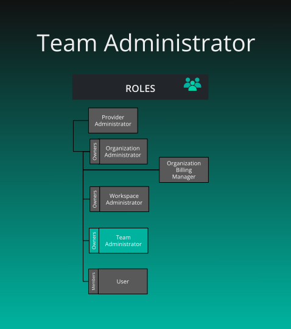

# Default Team Roles

> By default, Organizations have two roles available: Team Admins and Team Managers.

      Default Team Roles
    

    

        

      

  

      
<h2 id="team-administrator" class="heading-link">
  Team Administrator
  <a href="#team-administrator" class="heading-anchor" aria-label="Permalink to this heading">🔗</a>
</h2>

    

    

        
<strong>What is the purpose of this role?</strong>

<ul>
<li>Administration of teams</li>
</ul>

<strong>Who can assign this role?</strong>

<ul>
<li>Organization Administrator or Team owner</li>
</ul>

<strong>When this role first assigned?</strong>

<ul>
<li>Creation of new team or User Account creation</li>
</ul>

<strong>How many instances of these roles?</strong>

<ul>
<li>Min: 1, Max: many (based on plan)</li>
<li>Only first Team Admin would be the owner</li>
</ul>

<strong>Who can remove assignment of this role?</strong>

<ul>
<li>Organization Administrator or Team owner</li>
</ul>

<strong>What permissions does this role have?</strong>

<ul>
<li>Check <a href="/pr-preview/pr-1276/cloud/reference/default-permissions/">Permissions Reference</a></li>
</ul>

      

  

