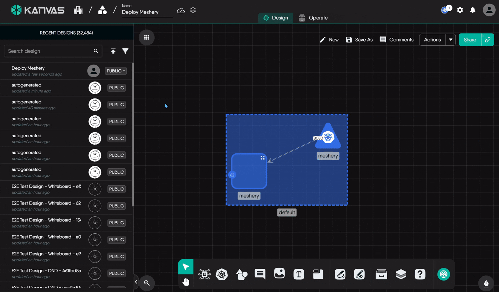
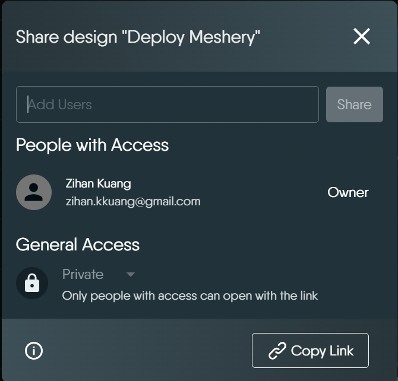

# Sharing Designs

> Share designs with other users and use access controls to manage design permissions and visibility.

In Kanvas, you can share your designs with other members of your organization and teams, and you can control access permissions. This page describes the different access types for designs and how to effectively use them.

  <h4 class="alert-heading" style="color: #3772ff;">Sharing Views</h4>
  
      You can share and control access to <a href="/pr-preview/pr-1276/kanvas/operator/views/">Views</a> in the same fashion as you do for Designs.
  

  <h4 class="alert-heading" style="color: #EBC017;">Verify People with Access after sharing</h4>
  
      In some earlier cases, the Share modal could report success while the grant or revoke was not applied. If you shared a design or view and collaborators still cannot open it—or someone you removed still has access—open <strong>Share</strong> on that resource and re-check the <strong>People with Access</strong> list. Re-add anyone who is missing, remove anyone who should not retain access, and confirm that collaborators can open the resource. Always treat <strong>People with Access</strong> as the source of truth after every share.
  

## Understanding visibility levels

Designs have visibility statuses that defines who can access your designs. These options offer different levels of exposure for content within your workspaces:

- **Private:** Designs with visibility status private define only you, the creator, and the user or team that have access based on granted access permission can view and edit the design. Other users cannot access it unless you explicitly share it with them.[^1]

- **Public:**  Making a design "Public" makes it accessible to anyone on the internet who has the link or discovers it through public channels. By default, users accessing a Public design are granted permissions to view, comment on, and edit the design. 

  <h4 class="alert-heading" style="color: #3772ff;">Why use public</h4>
  
      Public status is useful for sharing designs broadly, for example, as open-source templates, public demonstrations, or for soliciting feedback from a wider community. If your goal is to share broadly only within your organization, consider using a combination of private designs shared with specific organization-wide teams or workspaces.
  

- **Published:**  The published visibility setting is designed for sharing designs with a wider audience. Published designs become discoverable to other users and allow them to view, download, and clone the design. Users can find published designs through [Cloud Catalog](/pr-preview/pr-1276/cloud/concepts/catalog/) ([open catalog](https://cloud.layer5.io/catalog)).

## Granting access to individual users

When you share a design, those users or teams become collaborators. You can share your designs with other users by using the "Share" modal. This modal allows you to grant access to individual users or teams. The following steps show how you can grant access to individual users:

**Accessing the "Share" Modal:**

There are two primary ways to open the "Share" modal for a design:

1.  **From an Open design:**
    * First, open your Design or View in Kanvas.
    * Click the main **"Share" button**, which is typically located in the top right corner of the editor interface.

2.  **From the Recent Designs list:**
    * Click the **more options icon** (often represented by three vertical dots ⋮) associated with that design.
    * Select **"Share"** from the context menu that appears.

Once the "Share" modal is open, type the names or email addresses of the users or teams you want to invite as Collaborators. From the "Share" modal, you can also typically change the overall visibility status of the design (e.g., switching between Private and Public).

<figure>
  
  <figcaption>Updated Share modal (anonymous capture, Sep 2026): add users, <strong>People with Access</strong>, Private/Public visibility, and <strong>Copy Link</strong>. Owner shown as an anonymous session.</figcaption>
</figure>

## Owner vs. Collaborator

When you share a design, or when a design is shared with you, what you can do with it depends on whether you are the **Owner** or a **Collaborator**. 

-   **Owner:**
    -   You are the Owner if you created the design.
    -   As the Owner, you have complete control over your design. This includes:
        -   Viewing, editing, and modifying all aspects of the design.
        -   Deploying the design.
        -   Sharing the design with other users or teams (making them Collaborators) and revoking their access.
        -   Changing the design's overall visibility (e.g., from Private to Public).
        -   Deleting the design.

  <h4 class="alert-heading" style="color: #3772ff;">Limitation: Ownership Transfer</h4>
  
      transferring ownership of a design to another user is not currently supported in Kanvas.
  

-   **Collaborator (Shared User/Team):**
    -   When an Owner shares a design with you or your team, you become a Collaborator.
    -   As a Collaborator, you can actively work on the design. This typically means you can:
        -   View the design details.
        -   Modify configurations, add or remove components, and essentially edit the design's content.
        -   Deploy the design.
    -   However, Collaborators have certain limitations and **cannot**:
        -   Delete the design.
        -   Re-share the design with other users or teams.
        -   Change the design's overall visibility (e.g., from Private to Public).

**How You Get Collaborator Access:**

When an Owner shares a design, they add users or teams as Collaborators. Whether you are added individually or are part of a team that gains access, you receive the standard Collaborator permissions described above.

**Managing Access: Revoking and Inviting**

As the Owner of a design, you can manage who has access to it at any time using the "Share" modal. This allows you to:

-   Grant access to new users or teams: Add them as Collaborators on your design.
-   Revoke access from existing Collaborators: If someone no longer needs access, you can remove them.

> For example, if Sarah is added as a Collaborator to a design, she can edit it. If the design is shared with the "Engineering Team" and Sarah is a member, she also gains the same Collaborator access to edit the design through her team membership.

  <h4 class="alert-heading">Implications of adding a Design to a Workspace</h4>
  
      When you add design to a workspace, it signifies that all teams associated with that workspace will be allowed to access your designs even if it is private. Review your workspace&rsquo;s team assignments in order to verify which users will be granted access.
Learn more about <a href="/pr-preview/pr-1276/cloud/concepts/spaces/workspaces/">auditing and assigning Workspace access</a>.
  

## Sharing Your Design with a Link

You can easily share a direct link to your design:

1.  Open the "Share" modal for your design.
2.  Click the **"Copy Link"** button. This button is always available, whether your design is Private or Public.

**How the link works:**

-   **For Private Designs:** If your design is Private, copying and sending the link acts as a convenient pointer. However, the recipient **must also be explicitly added as a Collaborator** in the "Share" modal to be able to open and access the design. The link alone does not grant them access if they haven't been given permission.
-   **For Public Designs:** If your design's visibility is set to Public, anyone with the link can typically access it according to the permissions defined for Public designs (as discussed in "Understanding visibility levels" – for example, they might be able to view, comment, and edit).

  <h4 class="alert-heading" style="color: #3772ff;">Link Sharing vs. Permissions</h4>
  
      Using &ldquo;Copy Link&rdquo; is a quick way to direct people to your design, but remember that actual access is always controlled by the design&rsquo;s visibility status (Private/Public) and the explicit permissions you&rsquo;ve granted.
  

## Sharing with Multiple Users via Teams

You can efficiently share your designs with many users at once by sharing with **Teams**. When you share a design with a team, all members of that team become Collaborators on the design, gaining the standard Collaborator permissions.

There are two primary ways to share designs with teams:

1.  **Direct Sharing via the "Share" Modal:**
    * You can add a team as a Collaborator directly through the **design's** "Share" modal, similar to how you add individual users. This gives the team explicit access to that specific **design**.[^2]

2.  **Indirect Sharing via Workspace Association (Intended Mechanism):**
    * Another way access is intended to be managed for teams is through **Workspaces**. The general idea is:
        1.  Place your **design** (e.g., a Private Design) into a Workspace.
        2.  Assign one or more Teams to that same Workspace.
        3.  By this association, members of the assigned Team(s) should then inherit access to the **designs** within that Workspace, including Private designs.

> Learn more about auditing the access permission within [workspace](/pr-preview/pr-1276/cloud/concepts/spaces/workspaces/)

## Share and visibility notifications

Kanvas surfaces explicit notifications when a share or visibility action cannot complete. These messages replace earlier silent failures so you can tell success apart from an incomplete request.

| Situation | What you see | What to do |
| --- | --- | --- |
| You change visibility on a resource kind that does not support a visibility mutation | A notification that the visibility change is **unsupported** for that resource (not a success message) | Keep the resource's current visibility, or use a resource kind that supports Private / Public / Published transitions. |
| You click **Share** while the design or view body is still loading, or after the body failed to load | A notification that **sharing is unavailable** | Wait until the resource finishes loading, then open Share again. If the body failed to load, refresh or reopen the resource and retry once it loads successfully. |
| The Share modal cannot load the access list | A notification that the **access list failed to load**, instead of an empty collaborator list | Close and reopen Share, or refresh the page. Do not assume that an empty list means nobody has access—until the list loads, the owner row and existing grants may be hidden, which also blocks revoke actions. |

  <h4 class="alert-heading" style="color: #7A848E;">People with Access is authoritative</h4>
  
      After any grant or revoke, confirm the result in <strong>People with Access</strong> before you rely on the change. A success path updates that list; if the list did not load or the expected user is missing, treat the share as incomplete and retry.
  

[^1]: This functionality is not fully implemented yet. Users might occasionally observe that even when a team is assigned to a workspace, members of that team may not be able to access private designs within that workspace without explicit individual or team-level sharing for the design itself.
[^2]: This feature (direct sharing with teams via the "Share" modal) is not yet fully implemented and is planned for a future update.

