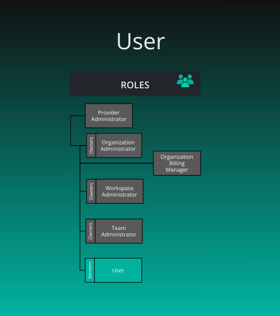

# Default User Role

> By default, members of an Organization are provided a User role.

      Default User Role
    

    

        

      

  

      
<h2 id="user" class="heading-link">
  User
  <a href="#user" class="heading-anchor" aria-label="Permalink to this heading">🔗</a>
</h2>

    

    

        
<strong>What is the purpose of this role?</strong>

<ul>
<li>To grant Organization members access to basic features and resources within the context of that Organization.</li>
</ul>

<strong>Who can assign this role?</strong>

<ul>
<li>Organization Administrators, Workspace Administrators and Team Administrators</li>
</ul>

<strong>When this role first assigned?</strong>

<ul>
<li>Automatically assigned to members on joining an Organization.</li>
</ul>

<strong>How many instances of these roles?</strong>

<ul>
<li>Min: 1, Max: many</li>
</ul>

<strong>Who can remove assignment of this role?</strong>

<ul>
<li>Organization Administrators, Workspace Administrators and Team Administrators</li>
</ul>

<strong>What permissions does this role have?</strong>

<ul>
<li>Check <a href="/pr-preview/pr-1277/cloud/reference/default-permissions/">Permissions Reference</a></li>
</ul>

      

  

