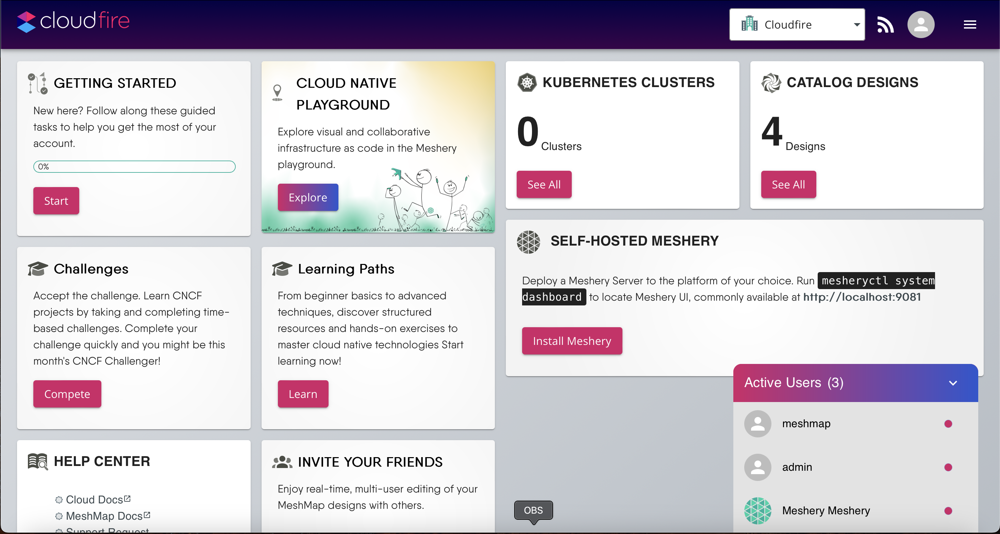
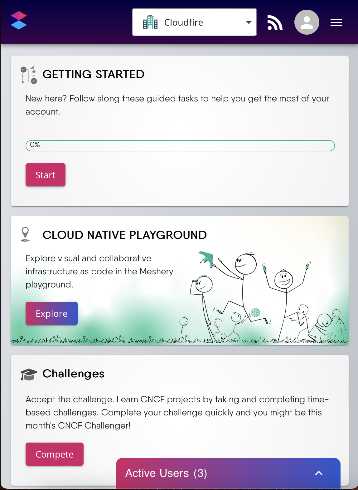
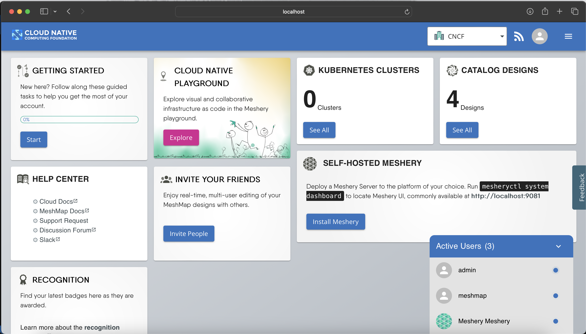
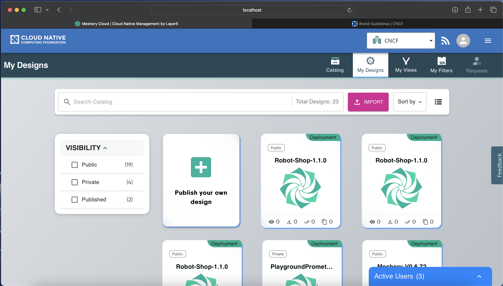
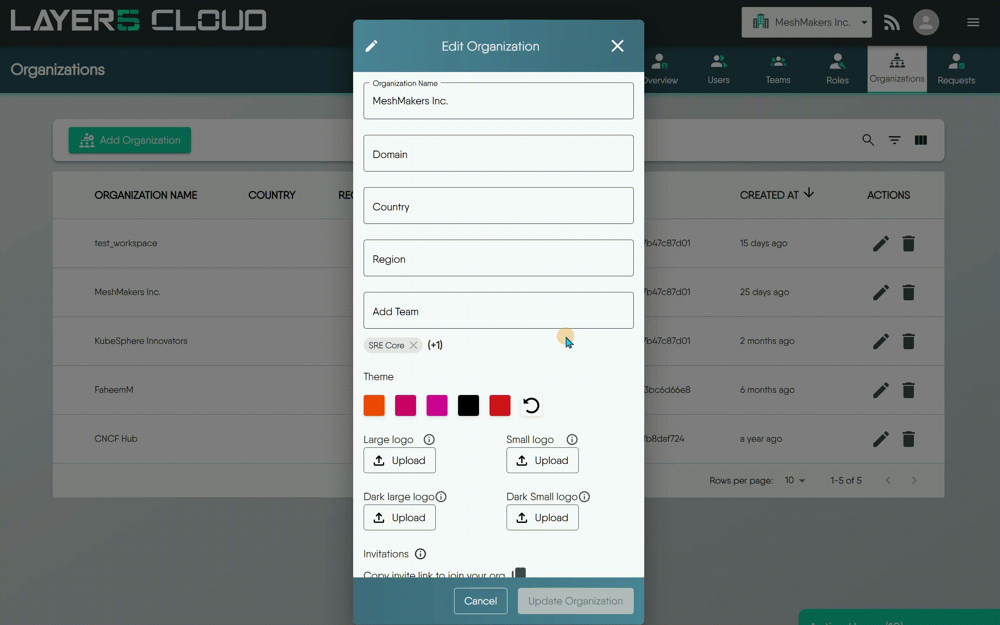
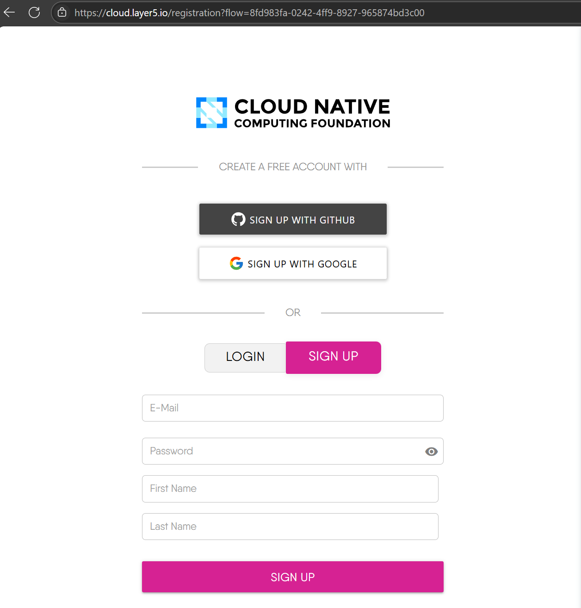
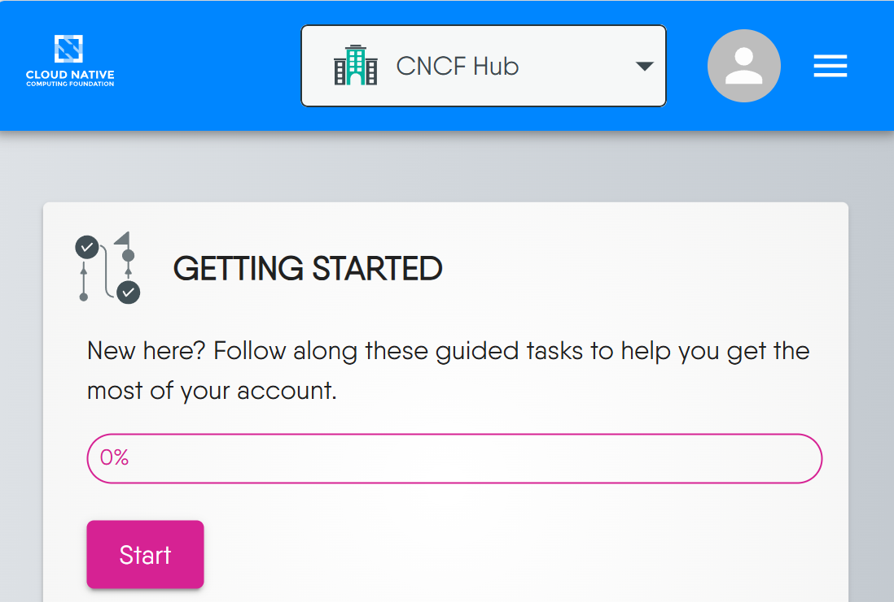
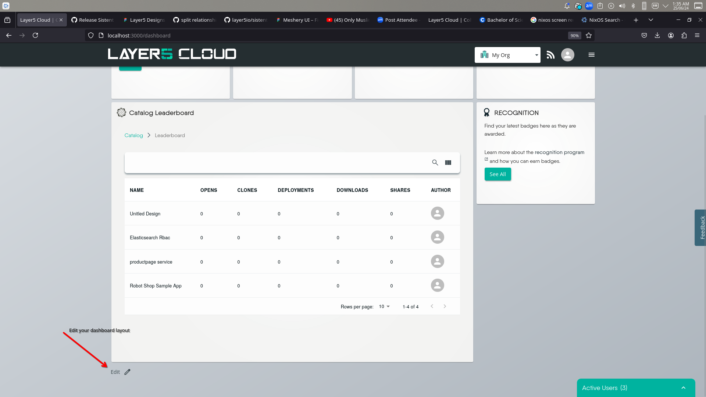
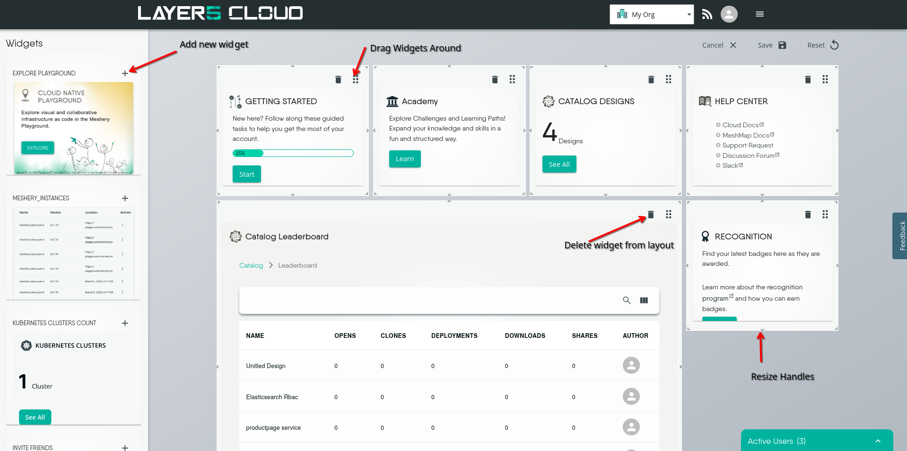
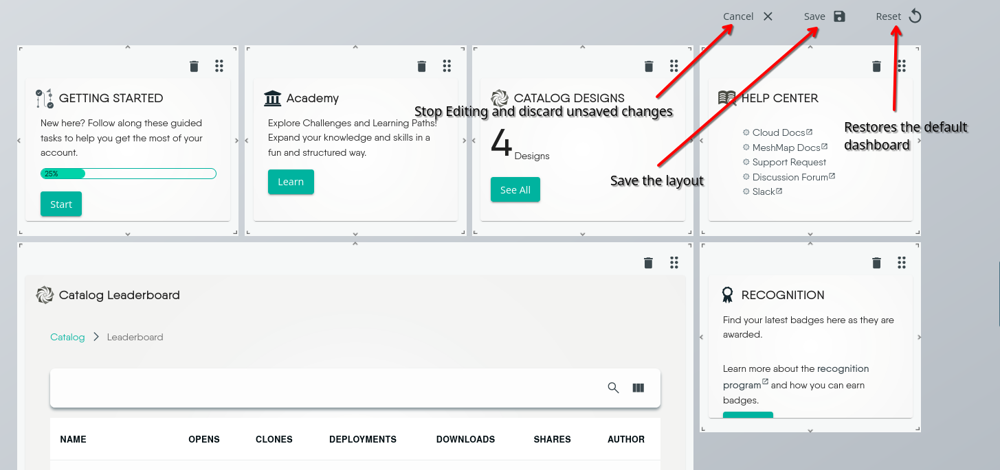

# White-labeling (Rebranding)

> Customize the appearance and branding of your engineering platform powered by Layer5 Cloud. 

You can change the logo, color scheme, domain name, and other aspects of the user interface to match your own identity and preferences. White-labeling enables you to offer a seamless and consistent experience to your customers, partners, or internal users who access your service mesh platform. White-labeling also helps you to differentiate your platform from other Layer5 Cloud users and competitors, and to enhance your brand recognition and loyalty.

## Customizing Themes

The Layer5 Cloud dashboard can be customized with your own branding, including your full-sized logo, logo mark, and color scheme. Customized theme colors also affect email notifications.

      Dashboard Example
    

    

        
This example includes a custom branding with colors and full-sized logo.

  <picture>
    <source srcset="/pr-preview/pr-1277/contentimg/cloud/guides/self-hosted/white-labeling/images/custom-branding-dashboard-cloudfire_hu_3bbc431c46dc731b.webp" type="image/webp" width="2940" height="1570">
    
  </picture>

      

  

      <i>Example: Cloudfire branding on Dashboard</i>

  

      Dashboard Mobile Example
    

    

        
This example includes a custom branding with colors and logo mark.

  <picture>
    <source srcset="/pr-preview/pr-1277/contentimg/cloud/guides/self-hosted/white-labeling/images/custom-branding-dashboard-mobile-cloudfire_hu_c166fc021ac6c579.webp" type="image/webp" width="1148" height="1570">
    
  </picture>

      

  

      <i>Example: Cloudfire branding in Catalog</i>

  

      Dashboard Mobile
    

    

        
This example includes a custom branding with colors and full-sized logo.

  <picture>
    <source srcset="/pr-preview/pr-1277/contentimg/cloud/guides/self-hosted/white-labeling/images/white-label-dashboard-example_hu_e16634db628b1240.webp" type="image/webp" width="2938" height="1676">
    
  </picture>

      

  

      <i>Example: CNCF branding on Dashboard</i>

  

      Catalog Example
    

    

        
This example includes a custom branding with colors and full-sized logo.

  <picture>
    <source srcset="/pr-preview/pr-1277/contentimg/cloud/guides/self-hosted/white-labeling/images/white-label-catalog-example_hu_f17eb5c22fa52568.webp" type="image/webp" width="2938" height="1676">
    
  </picture>

      

  

      <i>Example: CNCF branding on Catalog</i>

  

### Enable White Labeling: Organization Preferences

Layer5 Cloud supports customizing themes on a per organization basis. This includes the ability to upload your own logo and define your own color scheme. Your logo will be displayed in the top left corner of the dashboard. Both a full-sized logo and a logo mark are supported.

As an [Organization Administrator](/pr-preview/pr-1277/cloud/concepts/identity-and-security/roles/organization-roles/), you can add your organization's logo to the global navigation bar, which supports a large, horizontal logo for desktop users and a small, square logo for mobile users. The logo appears at the top of each user's window for all Layer5 Cloud pages within your organization.

      Preference Example
    

    

        
This example shows how to customize through different themes

      

  

      <i>Example: Selection of theme</i>

  

#### Custom Logos

You can upload your own logo for your organization. Logo appears in upper left corner of all Layer5 Cloud pages. All teams, workspaces, and users in your organization will use these custom logos.

Your custom logos will optionally be visible to external users if you choose to customize your login screen. Otherwise, your custom logos will only be visible to users within your organization.

If you use a mobile device, the logo mark will be visible.

#### Logo Image Requirements

Logo images must be either in SVG, PNG or GIF format. GIF images can be animated, but are not recommended given their distraction to users. The maximum file size for each image is 500 KB.
<pre>
Horizontal logo: 389 width x 32 height pixels
</pre>
If you upload a smaller or larger image, the image is resized to exactly 389 x 32 pixels. If the aspect ratio does not match, then the image will be distorted. For example, a 132 x 132 pixel image expands to 389 x 32 pixels, causing distortion.

<pre>
Square logo (mark): 32 width x 32 height pixels
</pre>

<ul class="nav nav-tabs" id="tabs-3" role="tablist">
  <li class="nav-item">
      <button class="nav-link active"
          id="tabs-03-00-tab" data-bs-toggle="tab" data-bs-target="#tabs-03-00" role="tab"
          data-td-tp-persist="full-sized logo example" aria-controls="tabs-03-00" aria-selected="true">
        Full-sized Logo Example
      </button>
    </li><li class="nav-item">
      <button class="nav-link"
          id="tabs-03-01-tab" data-bs-toggle="tab" data-bs-target="#tabs-03-01" role="tab"
          data-td-tp-persist="logo mark example" aria-controls="tabs-03-01" aria-selected="false">
        Logo Mark Example
      </button>
    </li>
</ul>

    

        
When users register through the <a href="https://docs.layer5.io/cloud/guides/organizations/org-management/#using-the-open-organization-invitation-link">Open Organization Invitation Link</a>, they will see the full-sized logo.

    

    

        
When logging into Layer5 Cloud on mobile devices, the small logo mark will be displayed.

    

### Uploading Your Logo

On the [Organizations page](https://cloud.layer5.io/identity/organizations), you can upload your custom logo for your organization.

1. Go to Menu and then [**Identity** > **Organization**].
1. To open the Edit window, click the pencil icon next to the organization name.
1. Click Select file to upload and select the logo image on your computer. You'll see a preview of your logo.
1. Click Save, if satisfied. You may change your custom logo images at any time.

## Contact Information in Email Notifications

White-labeling extends past the browser: the footer shared by every transactional email Layer5 Cloud sends - invitations, welcome mail, role changes, catalog publish decisions, design comment mentions, email verification and password recovery codes - is built from your organization's own contact information rather than Layer5's.

That covers what the message says. The address it arrives from is a separate setting: by default every message leaves through Layer5's shared mail server, so a fully branded email still arrives from a Layer5 address. An organization can instead register its own mail server on the **Email** tab of Edit Organization. Once the sending domain is verified, a connection test has passed and the server is turned on, application mail such as invitations and notifications leaves through that server from the organization's own domain, subject to its fallback setting. See [Bring Your Own Mail Server](/pr-preview/pr-1277/cloud/guides/organizations/org-management/bring-your-own-mail-server/).

The same five link fields drive both your sign-in pages and your email footers. Set them as an [Organization Administrator](/pr-preview/pr-1277/cloud/concepts/identity-and-security/roles/organization-roles/) on the [Organizations page](https://cloud.layer5.io/identity/organizations): click the pencil icon next to your organization name, then fill in the fields under **Login page links**.

| Field | Where it appears in email |
|---|---|
| Support Email | The "email" contact link in the footer |
| Discussion Forum URL | The "forum" contact link and the forum icon |
| Slack URL | The "slack" contact link and the Slack icon |
| Privacy Policy URL | The "privacy policy" link in the footer's legal line |
| Terms of Service URL | The "terms of service" link in the footer's legal line |

### How each field is resolved

Resolution is **per field, not all-or-nothing**. Each of the five fields is resolved independently, in this order:

1. **Your organization's value**, when you have set that field.
2. Otherwise, the **Provider Organization's** value for that field - the contact details configured on the provider organization that owns the deployment.
3. Otherwise, the Layer5 default baked into the email template (`support@layer5.io`, `discuss.meshery.io`, `slack.layer5.io`, and the Layer5 Cloud legal pages).

Because the fallback is per field, filling in one field never blanks the others. An organization that publishes only its own support inbox keeps the Provider Organization's forum, Slack, privacy policy, and terms of service alongside that inbox. A field left blank - or containing only whitespace - counts as unset and does not shadow the value it would otherwise fall back to.

  <h4 class="alert-heading">Self-hosted deployments: configure the Provider Organization</h4>
  
      On a self-hosted deployment, the second tier of this fallback is <em>your</em> Provider Organization, not Layer5. Setting the five link fields on your Provider Organization gives every organization in your deployment a sensible branded default, so a member organization that has not filled in its own contact details still never surfaces Layer5&rsquo;s support channels to your users. See <a href="/pr-preview/pr-1277/#configuring-a-subdomain">Configuring a subdomain</a> for how to reach your Provider Organization.
  

### Value formats

Values are normalized before they are rendered into an email, so the link is always followable from a mail client:

- A **root-relative** value such as `/legal/privacy-policy.html` is resolved against your organization's own host - your custom domain when you have configured one, and the deployment's base URL otherwise. Recipients therefore stay on your domain rather than being sent to the canonical Layer5 Cloud host.
- A **bare email address** such as `support@example.com` is turned into a `mailto:` link.
- **Absolute** `http://`, `https://`, `mailto:`, and `tel:` values are used as given.

As on the sign-in pages, values are sanitized server-side. `javascript:`, `data:`, and protocol-relative (`//host`) values are dropped, and the field then falls back as though it were unset.

## Organization Dashboard Customization

Layer5 Cloud supports customizing dashboard layouts on a per organization basis. As an administrator of your organization, you can customize the dashboard experience for all members of your organization. To customize your organization's dashboard, select from a collection of widgets to include or exclude.

<iframe width="560" height="315" src="https://www.youtube.com/embed/O07szEL5LSk" title="YouTube video player" frameborder="0" allow="accelerometer; autoplay; clipboard-write; encrypted-media; gyroscope; picture-in-picture; web-share" referrerpolicy="strict-origin-when-cross-origin" allowfullscreen></iframe>

*To customize your organization's dashboard, follow the steps in this video or the steps outlined in the screenshots below.*

      Edit your Org&rsquo;s Dashboard
    

    

        

  <picture>
    <source srcset="/pr-preview/pr-1277/contentimg/cloud/guides/self-hosted/white-labeling/images/custom-dashboard-1_hu_9283f71bb2235f42.webp" type="image/webp" width="1920" height="1080">
    
  </picture>

      

  

      <i>Click &lsquo;Edit&rsquo; to enter into customization mode.</i>

  

      Add and Remove Widgets
    

    

        

  <picture>
    <source srcset="/pr-preview/pr-1277/contentimg/cloud/guides/self-hosted/white-labeling/images/custom-dashboard-2_hu_a81fc168aea8a9c1.webp" type="image/webp" width="1918" height="957">
    
  </picture>

      

  

      <i>Pick and choose which widgets to include. Reposition and resize each as you like.</i>

  

      Save and Publish Dashboard
    

    

        

  <picture>
    <source srcset="/pr-preview/pr-1277/contentimg/cloud/guides/self-hosted/white-labeling/images/custom-dashboard-3_hu_9967bd6a0a2855b8.webp" type="image/webp" width="1455" height="685">
    
  </picture>

      

  

      <i>Make your customized layout available to all members of your org or reset your changes to revert to the default layout.</i>

  

  <h4 class="alert-heading">Widget Limitations</h4>
  
      Each of the prebuilt widgets can be added to a dashboard only once. If you find that a particular widget that you would like to have is not available, <a href="https://layer5.io/company/contact">please let us know</a>.
  

## Custom Domain Name and Login Screen

  <h4 class="alert-heading" style="color: #3772ff;">Info</h4>
  
      Not sure whether you want a subdomain of the platform or your own separate custom domain — and whether you&rsquo;ll need your own identity provider? The <a href="/pr-preview/pr-1277/cloud/guides/organizations/configuration-scenarios/">Organization Configuration Scenarios</a> guide names each combination (Hosted, Branded, White-Label) and explains when to choose one over the next.
  

Layer5 Cloud supports customizing the login screen based on custom domain name. Redirect your users to your own domain name. For example, if your domain name is `mycompany.com`, you can redirect users to `meshery.mycompany.com`.

<!-- 

      <iframe allow="accelerometer; autoplay; clipboard-write; encrypted-media; gyroscope; picture-in-picture; web-share; fullscreen" loading="eager" referrerpolicy="strict-origin-when-cross-origin" src="https://www.youtube.com/embed/hZuhmP7lenk?autoplay=0&amp;controls=1&amp;end=0&amp;loop=0&amp;mute=0&amp;start=0" style="position: absolute; top: 0; left: 0; width: 100%; height: 100%; border:0;" title="Example: Replace the Layer5 logo with your own logo."></iframe>
    

 -->
<iframe width="560" height="315" src="https://www.youtube.com/embed/hZuhmP7lenk?si=1o8KLhk3K-HeJCcm" title="YouTube video player" frameborder="0" allow="accelerometer; autoplay; clipboard-write; encrypted-media; gyroscope; picture-in-picture; web-share" referrerpolicy="strict-origin-when-cross-origin" allowfullscreen></iframe>

Example: Layer5 Cloud custom branding on login screen with CNCF branding. Live example: <a href="https://cloud.layer5.io/signup?program=cncf">https://cloud.layer5.io/signup?program=cncf</a>

A subdomain is the part of a URL before the root domain. You can configure your subdomain as www or as a distinct section of your site, like hub.cncf.io.

Subdomains are configured with a CNAME record through your DNS provider.

  <h4 class="alert-heading">Changing Custom Domain May Break Academy Integration</h4>
  
      Changing your custom domain name after configuring an external Academy can break the content integration. If you change your domain, you <strong>must</strong> also update the organizational folder name (<code>/content/learning-paths/&lt;your-org-name&gt;</code>) in your Academy content repository to match.
  

### Configuring a subdomain

To set up a www or custom subdomain, such as `www.example.com` or `meshery.example.com`, you must add your domain in the repository settings. After that, configure a CNAME record with your DNS provider.

In Layer5 Cloud, navigate to your Provider Organization.

Under your Organization name, click Edit. If you cannot click the "Edit" action, verify that you are a [Provider Administrator](/pr-preview/pr-1277/cloud/concepts/identity-and-security/roles/).

Under "Custom domain", type your custom domain, then click Save. This will create a server configuration that will require a reboot in order to take effect.

  <h4 class="alert-heading">Internationalized Domain Names</h4>
  
      If your custom domain is an internationalized domain name, you must enter the Punycode encoded version.
  

Navigate to your DNS provider and create a CNAME record that points your subdomain to the default domain for your site. For example, if you want to use the subdomain `hub.cncf.io` for your user site, create a CNAME record that points `hub.cncf.io` to `cloud.layer5.io`. For more information about how to create the correct record, see your DNS provider's documentation.

  <h4 class="alert-heading">Risks of Using Wildcard DNS Records</h4>
  
      Warning: We strongly recommend that you do not use wildcard DNS records, such as <code>*.example.com</code>. These records put you at an immediate risk of domain takeovers, even if you verify the domain. For example, if you verify example.com this prevents someone from using <code>a.example.com</code>, but they could still take over <code>b.a.example.com</code> (which is covered by the wildcard DNS record).
  

#### Domain Format Requirements

1. **Uniqueness:** The domain must be unique across all organizations in Meshery Cloud. It cannot be in use by another organization.

2. **Format:** Do not include the protocol (http:// or https://) or the www. prefix. You should enter the pure hostname (e.g., meshery.mycompany.com).

3. **Length:** The domain name must be between 3 and 63 characters long.

4. **Removing a Domain:** To remove a custom domain assignment, simply clear the domain field and save. An empty field is treated as a request to nullify the domain linkage.

#### Verifying your custom domain

Open Terminal.

To confirm that your DNS record is configured correctly, use the dig command, replacing `hub.cncf.io` with your subdomain.

<pre>
$ dig WWW.EXAMPLE.COM +nostats +nocomments +nocmd
> ;hub.cncf.io.                    IN      A
> hub.cncf.io.             3592    IN      CNAME   .
> meshery.layer5.io.      43192    IN      CNAME   meshery.layer5.io .
> meshery.layer5.io .        22    IN      A       192.0.2.1
</pre>

<!-- FUTURE: SUPPORT FOR HTTPS 
Optionally, to enforce HTTPS encryption for your site, select Enforce HTTPS. It can take up to 24 hours before this option is available. -->

### Social sign-in on a custom domain

**Social sign-in (Google and GitHub) works on any custom domain** — whether it is a subdomain of your deployment's **base domain** (its registrable domain, technically the [eTLD+1](https://developer.mozilla.org/en-US/docs/Glossary/eTLD), for example `layer5.io` or `example.com`) or a fully-custom domain on a different base domain. In every case, the Google and GitHub buttons appear and complete sign-in using the deployment's default identity providers. No per-organization setup is required, and bringing your own identity provider is **not** a prerequisite for social sign-in.

- **Same base domain.** If the custom domain is a subdomain of your deployment's base domain — for example a deployment at `cloud.example.com` with a `meshery.example.com` custom domain (or, on the hosted service, a Layer5-provisioned partner subdomain such as `partner.layer5.io`) — Google and GitHub sign-in work out of the box with the deployment's default identity providers.

- **Different base domain (fully-custom).** If the custom domain sits on a different base domain — for example you CNAME `meshery.yourcompany.com` to the hosted `cloud.layer5.io`, where `yourcompany.com` and `layer5.io` are different base domains — Google and GitHub sign-in still work out of the box, again using the deployment's default identity providers. You only need to bring your own identity provider credentials (BYOC) if you want your own brand on the consent screen, your own OAuth rate limits and audit trail, corporate single sign-on, or a distinct authentication boundary — never merely to enable social sign-in.

  <h4 class="alert-heading">Social sign-in works without bringing your own identity providers</h4>
  
      On any custom domain, the Google and GitHub buttons are <strong>shown</strong> and fully functional alongside email-and-password sign-in, using the deployment&rsquo;s default identity providers — no per-organization configuration is required. Bringing your own identity providers (BYOC) remains optional and changes <em>whose</em> OAuth apps and consent screen are used, not <em>whether</em> social sign-in is available. See <a href="/pr-preview/pr-1277/cloud/guides/self-hosted/planning/identity-services/">Identity Services</a> for what BYOC is and when you might want it.
  

The same base domain / different base domain split above still marks an **authentication boundary**. Organizations that share an identity provider (the canonical host and custom domains that use the shared, central provider) sit within the same authentication boundary, while an organization that brings its own (BYOC) provider is a distinct authentication boundary: **same identity provider source means the same security boundary**, regardless of how the host is named. See [Identity Services → The identity provider is the security boundary](/pr-preview/pr-1277/cloud/guides/self-hosted/planning/identity-services/#the-identity-provider-is-the-security-boundary) and [Identity and Security → Security Boundaries](/pr-preview/pr-1277/cloud/concepts/identity-and-security/#security-boundaries).

## Frequently asked questions about white labeling

  
Do I need to self-host Layer5 Cloud in order to white-label it?

  
No, you can access and use all the same custom theming, custom dashboards, and organization preferences from the hosted version of Layer5 Cloud as well.

  
Do users have to use my custom URL to access the Organization?

  
No. In addition to your custom URL, you'll always be able to log in from our website and access your Organization from <https://cloud.layer5.io>.

  
When I send someone a link that includes my custom URL, do they need to be logged in?

  
Yes. Users will need to be signed in through your custom URL (not through cloud.layer5.io) in order to open links that include your custom URL. Users who are not logged in can quickly do so, and subsequently, be redirected to the link you have shared.

  
Why does the custom domain work for my colleagues but not for me?

  
This issue could potentially be related to your local network environment. It's possible that a local proxy client, VPN, or network accelerator on your computer might be intercepting the network request before it can reach the public internet.

