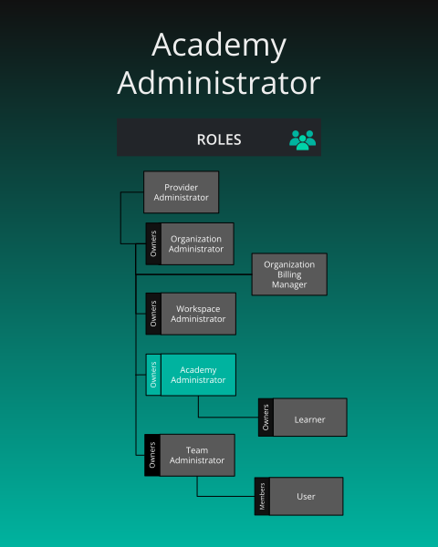
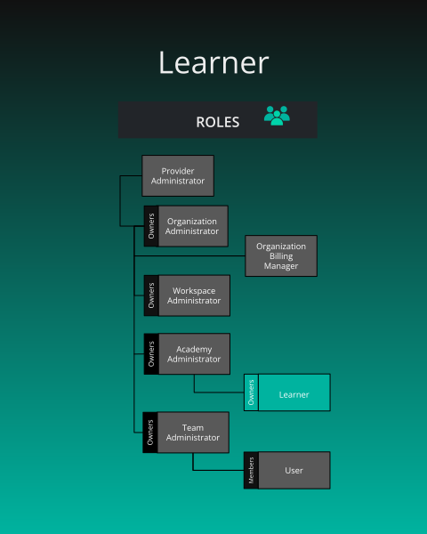

# Default Academy Roles

> By default, Academy has two roles available: Academy Administrator and Learner.

      Academy Administrator
    

    

        

      

  

      
<h2 id="academy-administrator" class="heading-link">
  Academy Administrator
  <a href="#academy-administrator" class="heading-anchor" aria-label="Permalink to this heading">🔗</a>
</h2>

    

    

        
<strong>What is the purpose of this role?</strong>

<ul>
<li>Management of an organization&rsquo;s academy, learner management, and access to academy instructor console.</li>
</ul>

<strong>Who can assign this role?</strong>

<ul>
<li>Organization Administrators</li>
</ul>

<strong>When this role first assigned?</strong>

<ul>
<li>Manually assigned by an Organization Administrator.</li>
</ul>

<strong>How many instances of these roles?</strong>

<ul>
<li>Min: 0, Max: many</li>
</ul>

<strong>Who can remove assignment of this role?</strong>

<ul>
<li>Organization Administrators</li>
</ul>

<strong>What permissions does this role have?</strong>

<ul>
<li>Check <a href="/pr-preview/pr-1279/cloud/reference/default-permissions/">Permissions Reference</a></li>
</ul>

      

  

      Learner
    

    

        
Learner = A <a href="/pr-preview/pr-1279/cloud/concepts/identity-and-security/roles/user-role/">User</a> who has registered for academy content.

      

  

  <h4 class="alert-heading">Managing Learner Costs</h4>
  
      While the maximum number of instances is unlimited, the available seats for Learners is determined by your organization&rsquo;s subscription plan. Please be mindful of your subscription to manage costs effectively.
  

      
<h2 id="learner" class="heading-link">
  Learner
  <a href="#learner" class="heading-anchor" aria-label="Permalink to this heading">🔗</a>
</h2>

    

    

        
<strong>What is the purpose of this role?</strong>

<ul>
<li>To enroll in academy content within the organization&rsquo;s academy.</li>
</ul>

<strong>Who can assign this role?</strong>

<ul>
<li>Organization Administrators or Academy Administrators</li>
</ul>

<strong>When this role first assigned?</strong>

<ul>
<li>Automatically to users who join through a special learner invite link</li>
<li>Manually by an Organization Administrator or Academy Administrator</li>
</ul>

<strong>How many instances of these roles?</strong>

<ul>
<li>Min: 0, Max: many</li>
</ul>

<strong>Who can remove assignment of this role?</strong>

<ul>
<li>Organization Administrators or Academy Administrators</li>
</ul>

<strong>What permissions does this role have?</strong>

<ul>
<li>Check <a href="/pr-preview/pr-1279/cloud/reference/default-permissions/">Permissions Reference</a></li>
</ul>

<strong>Status as a Learner</strong>

Each individual academy content item (learning path, certification, or challenge) that a learner enrolls in tracks one of the following 4 status types:

<table>
  <thead>
      <tr>
          <th>Status</th>
          <th>What it means</th>
      </tr>
  </thead>
  <tbody>
      <tr>
          <td>registered (enrolled)</td>
          <td>They signed up but haven&rsquo;t started</td>
      </tr>
      <tr>
          <td>completed</td>
          <td>They finished the course</td>
      </tr>
      <tr>
          <td>failed</td>
          <td>They didn&rsquo;t pass</td>
      </tr>
      <tr>
          <td>withdrawn</td>
          <td>They left the course</td>
      </tr>
  </tbody>
</table>

      

  

